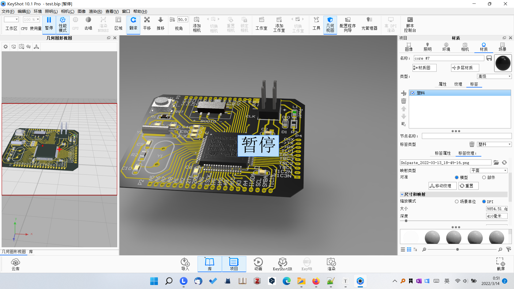
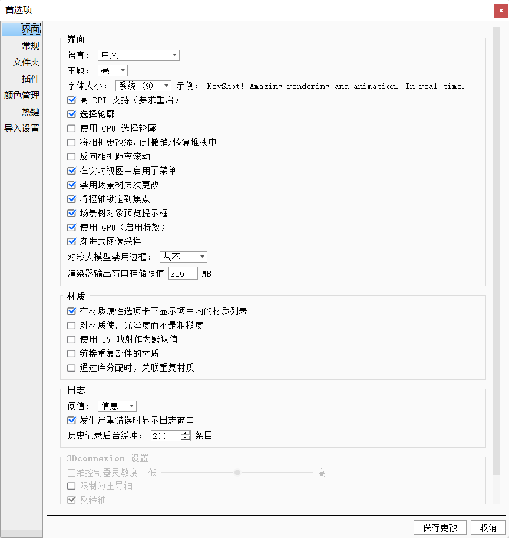
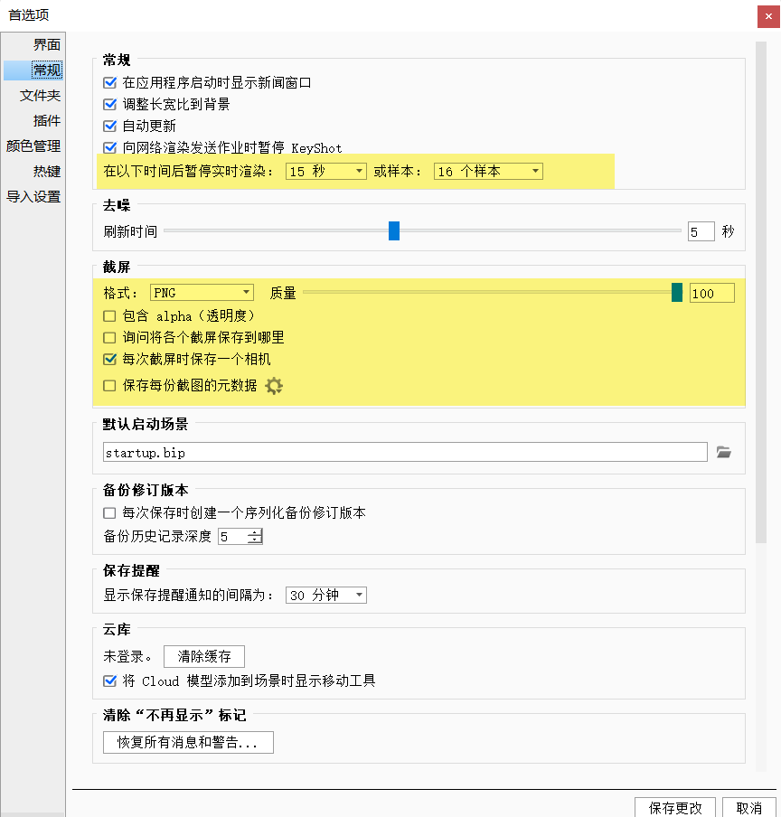
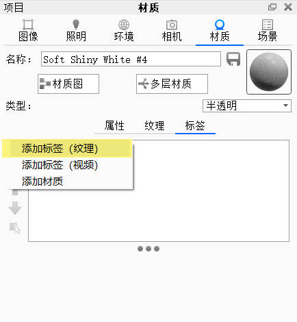
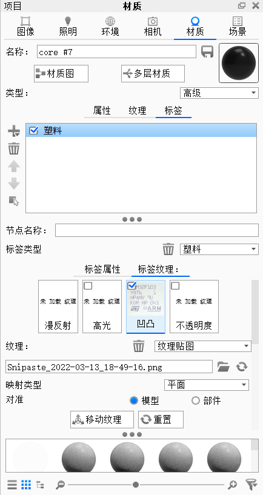
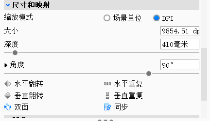
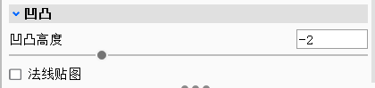
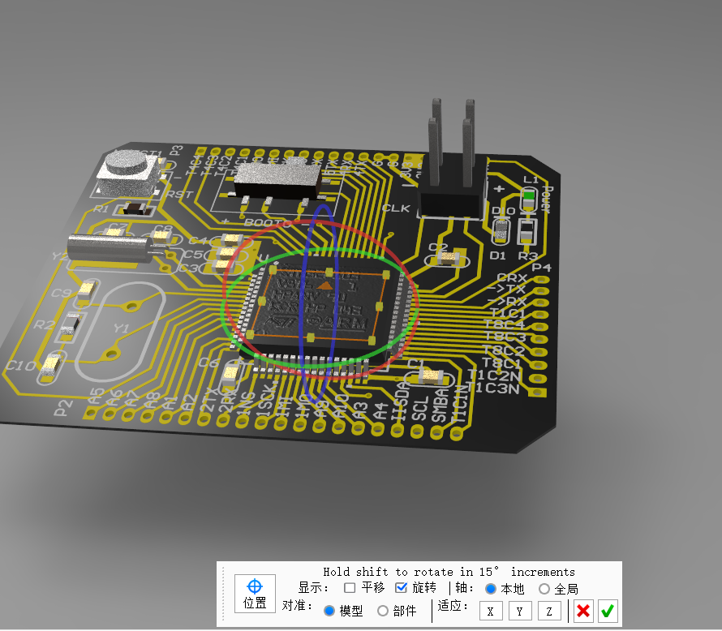
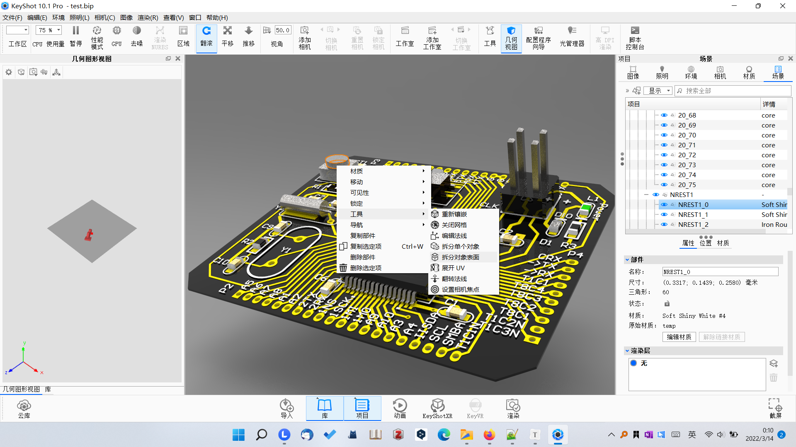
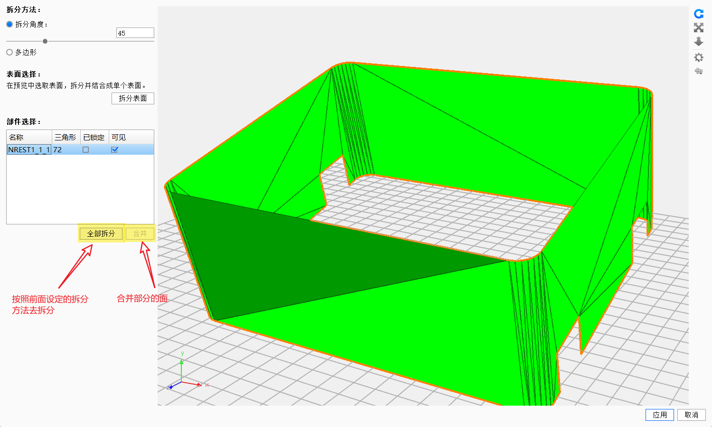

**设置** 

`编辑` - `首选项` 

     

场景 - 模型的树结构

几何视图

**导入**

AD要保留PCB板子的铜线，布线模型的话，需要导出 3DPDF模型， `Exoskeleton_controller.pdf.mtl `， `Exoskeleton_controller.pdf.obj`

**贴图** 

keyshot会将贴图看作是类似于蒙版的东西，贴图的不同颜色可以**改变被贴图对象的一些属性**，表示凹凸深度，透明度，漫反射，高光等属性。

选择贴图的`模型部分`，进入`材质选项卡`，在`标签`中添加图片，然后`缩放，平移，旋转`到合适的地方，选择需要改变的被贴图对象的属性和参数。

       

图  添加贴图；贴图修改凹凸属性；贴图的缩放，旋转和平移操作； 凹凸的深度设置

 

图 点击贴图的缩放，旋转和平移操作后的界面，橙色方框处为贴图大小

**模型不同面上不同的材质** 

开启`几何视图`，选中一个模型`右键`，选择`工具`，然后`拆分对象表面`。

全拆，可以将一个模型的所有面拆分成很多个零碎的面。

合并，可以合并一些材质需要设置一样的面，方便后期添加材质

 

 