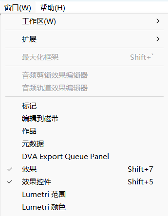
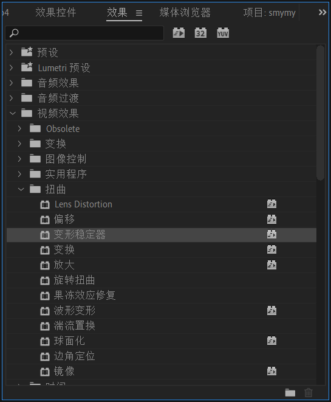
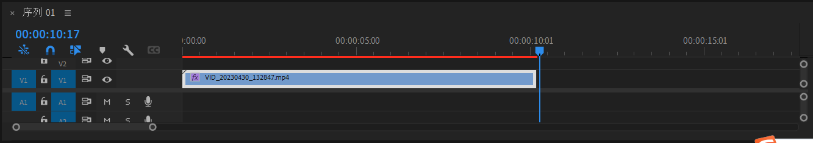
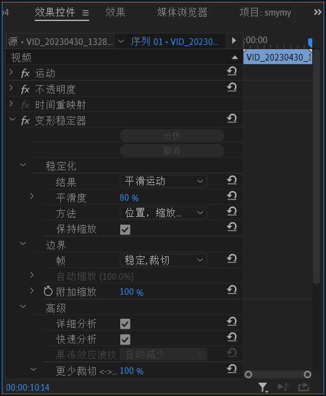
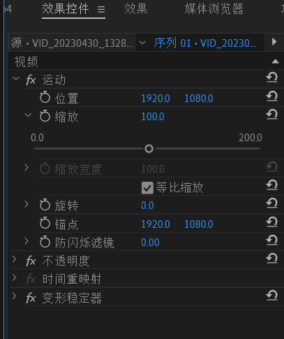

##### 视频去抖动：

    

`窗口 - 效果`  打开效果选项卡，在其中找到 `变形稳定器` ，双击或者拖动到 `视频轨道` 中即可将这个效果应用到视频中。单击 `视频轨道` ，可以在 `效果控件` 中调节效果对应的参数。

图： 视频轨道

**稳定结果**可以选择：不动，平滑运动。 不动适合镜头完全不动的情况，稳定后的画面视角完全不动。平滑运动则画面视角平滑运动。平滑度越大，视角运动越平滑。

##### 视频裁剪

可以用通过 `效果控件` 上的 `运动` 实现，可拖动进行缩放，拖动画面可以平移。

