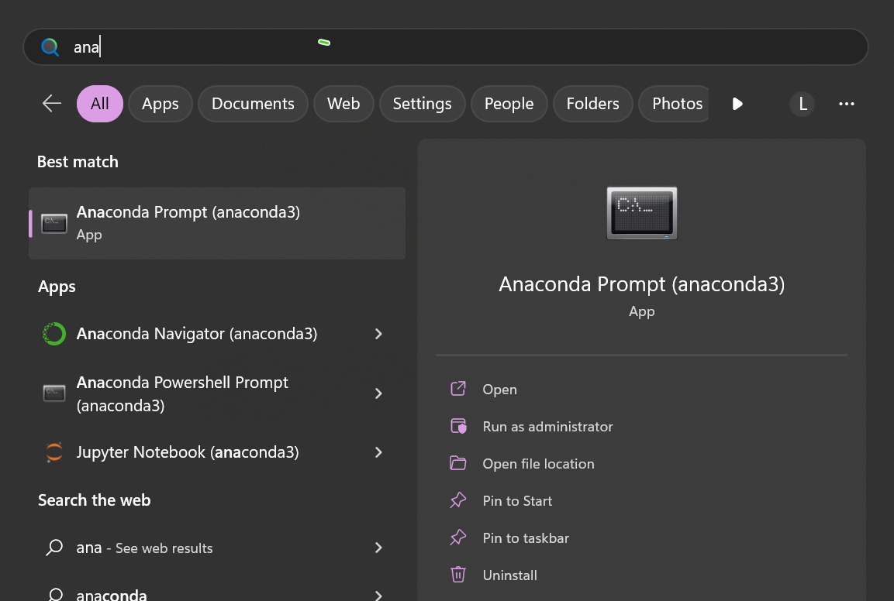
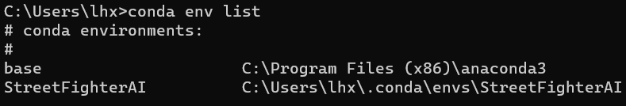

### 下载

　　[官网下载](https://www.anaconda.com/products/distribution)

　　推荐下载python3版本, 毕竟未来python2是要停止维护的.


### 安装

1. 双击Anaconda3-5.0.0-Windows-x86_64.exe文件


### 环境变量配置(windows) 

> can skip this step by using ***Anaconda Prompt*** 
>
>  
>
> 


此电脑----> 点击右键 ---- > 选择属性 -----> 高级系统设置 ------>环境变量


环境变量 Path 中添加 anaconda的安装目录：

① anaconda安装的目录 D:\Download\ANACONDA

② anaconda/scripts的目录 D:\Download\ANACONDA\Scripts

③ bin的目录 D:\Download\ANACONDA\Scripts\Library\bin


重新打开CMD，  输入 `conda --version` 检查是否添加成功：

```
C:\Users\lhx>conda --version
conda 22.9.0
```


### 指令

为了避免可能发生的错误, 我们在命令行输入`conda upgrade --all` 先把所有工具包进行升级

**创建自己的虚拟环境** 

创建一个名称为learn的虚拟环境并指定python版本为3(这里conda会自动找3中最新的版本下载)

```
conda create -n learn python=3
```

**切换环境** 

```
activate learn
```

**注销当前环境**

```
deactivate
```

**删除环境**

```
conda remove -n xiaolv --all
```

**查看已经存在的环境**

```
conda env list
```



环境路径是指其对应解释器所在的路径，IDE可以利用这个路径找到对应的解释器解析代码

**某个环境中安装第三方包** 

输入

```
conda install requests
```

或者

```
pip install requests
```

**卸载第三方包** 

那么怎么卸载一个包呢

```
conda remove requests
```

或者

```
pip uninstall requests
```

**查看环境包信息**

要查看当前环境中所有安装了的包可以用

```
conda list 
```

**导入导出环境** 

如果想要导出当前环境的包信息可以用

```
conda env export > environment.yaml  （这是一个路径，比如：G:\test\environment.yaml）
```

conda 更新

```
conda update python
```

or

```
conda update -n base -c defaults conda
```


### . 添加国内源

- 查看现有源

```
conda config --show-sources
```

- 添加国内清华源

```
conda config --add channels https://mirrors.tuna.tsinghua.edu.cn/anaconda/pkgs/free/
conda config --add channels https://mirrors.tuna.tsinghua.edu.cn/anaconda/pkgs/main/
```

- 删除默认源

```
conda config --remove channels defaults
```


activate // 切换到base环境

activate learn // 切换到learn环境

conda create -n learn python=3 // 创建一个名为learn的环境并指定python版本为3(的最新版本)

conda env list // 列出conda管理的所有环境

conda list // 列出当前环境的所有包

conda install requests 安装requests包

conda remove requests 卸载requets包

conda remove -n learn --all // 删除learn环境及下属所有包

conda update requests 更新requests包

conda env export > environment.yaml // 导出当前环境的包信息

conda env create -f environment.yaml // 用配置文件创建新的虚拟环境