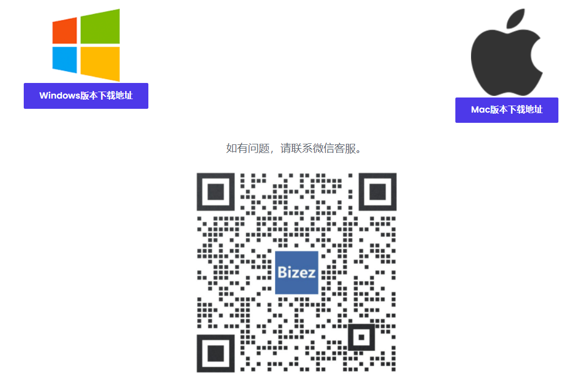
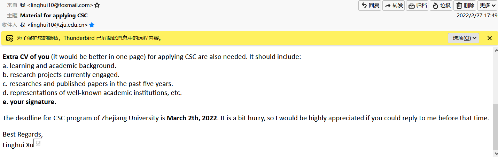
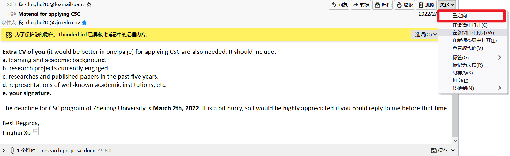
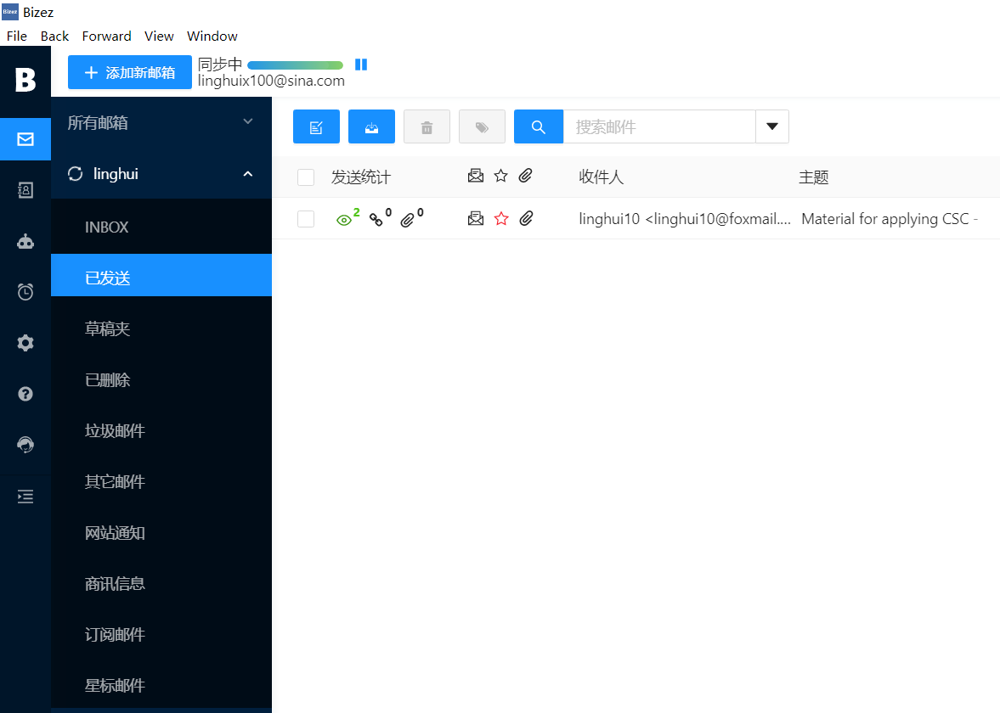
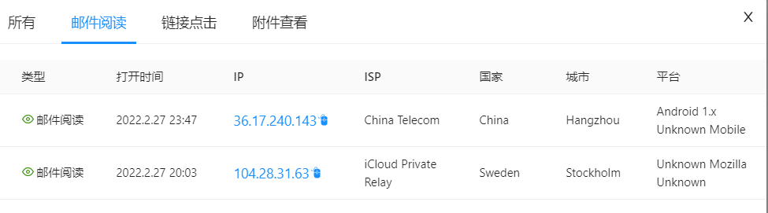

### bizez

[下载地址]([Bizez](https://app.bizez.cc/#/)) 

但是使用该客户端，发送的邮件有自带的签名，跟踪的功能主要是由邮箱内的透明图片实现的。打开邮件后，加载图片，就可以实现信息跟踪。

图  带跟踪功能的邮件 

所以，我们可以先发给自己的邮箱，然后删除签名，注意不要删除透明图片，后重定向给别人：

**跟踪信息** 

 

图   

 

图    邮件跟踪信息

