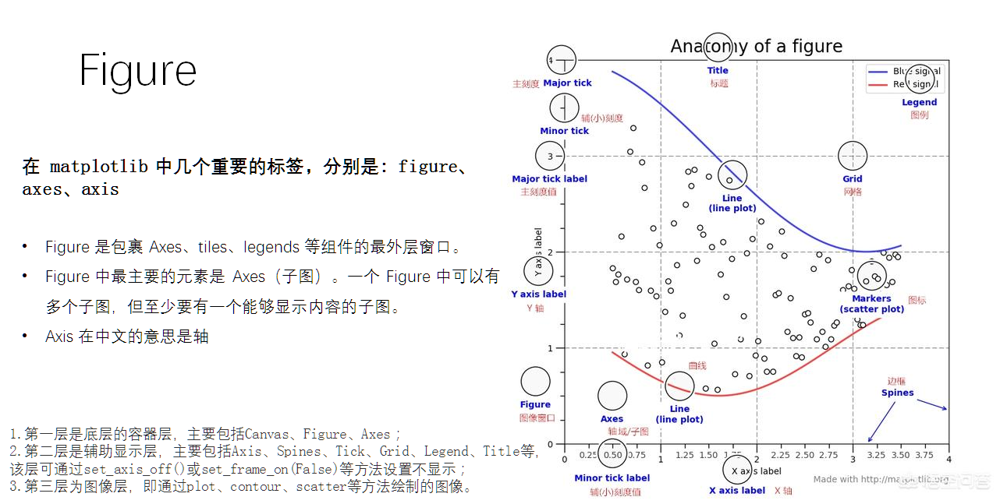
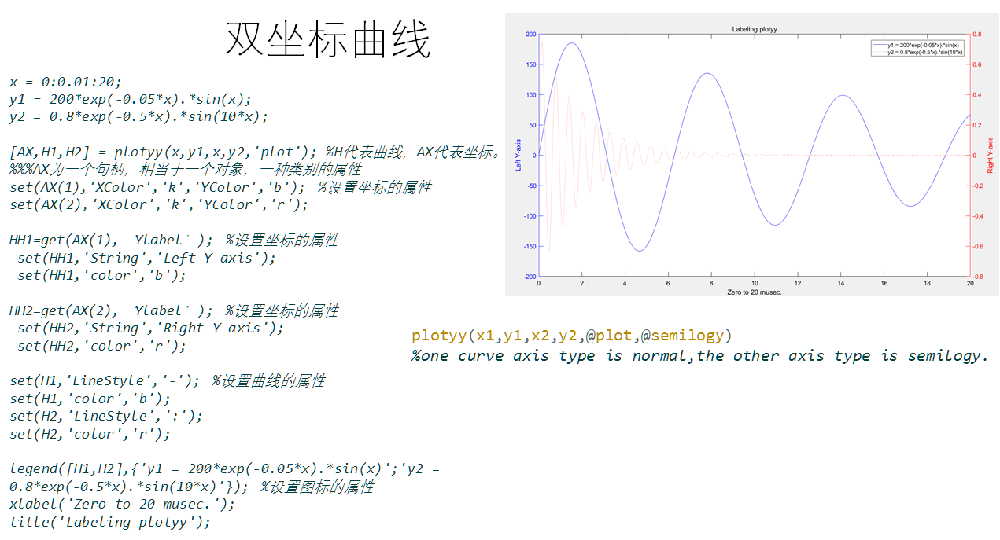
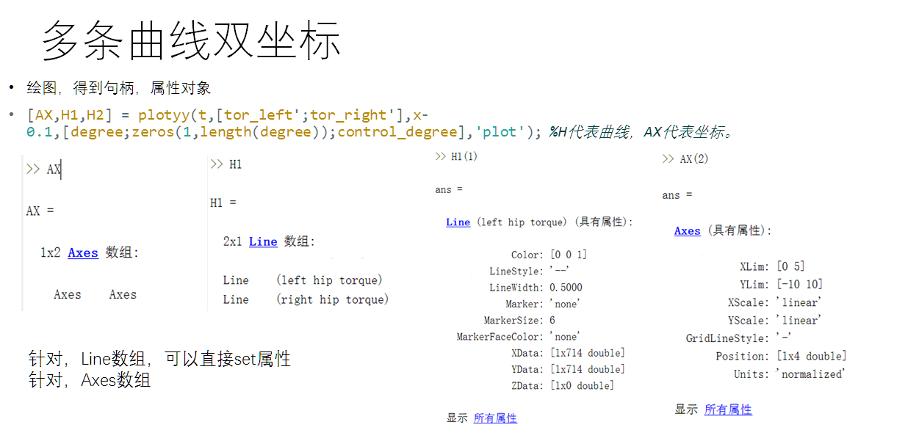
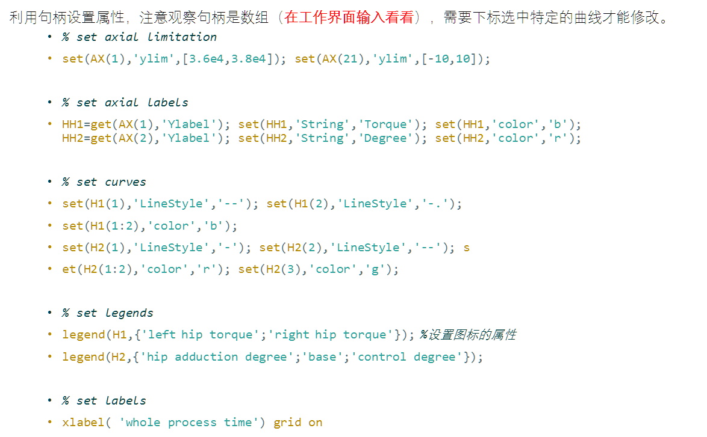
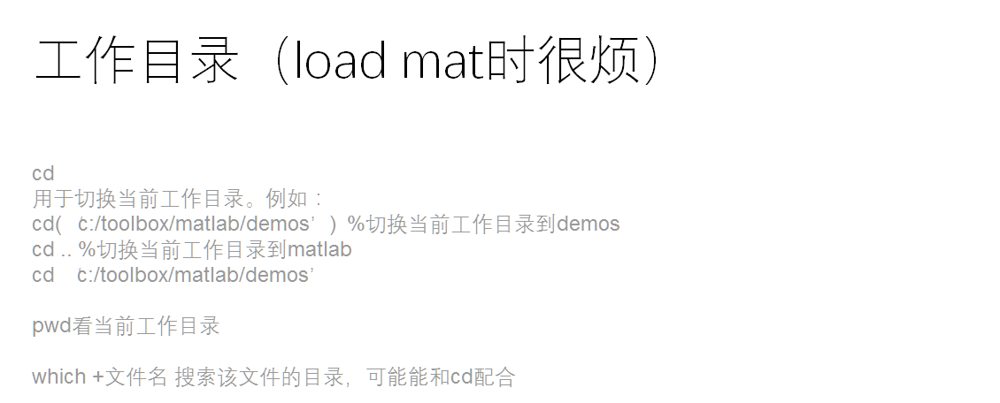
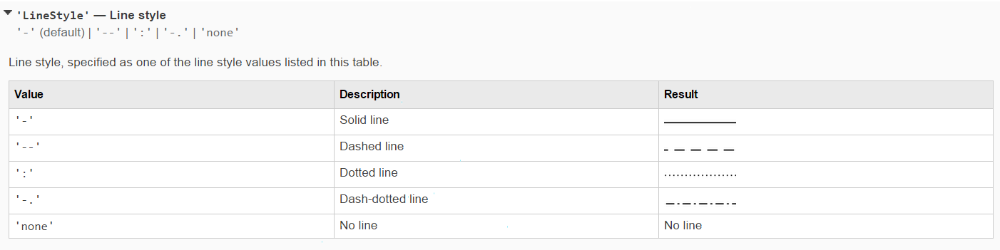
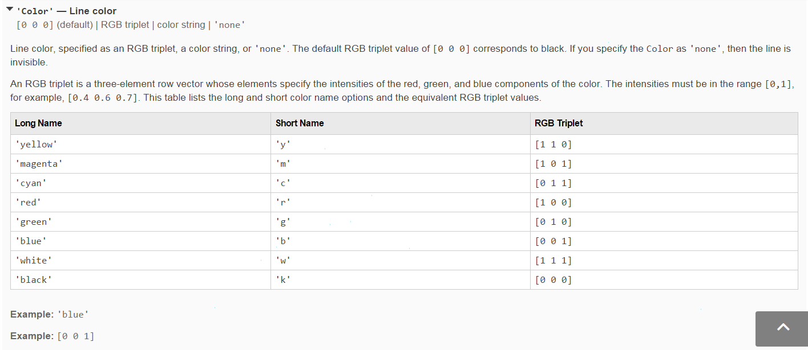

### 1. 输入输出

#### input() 

```matlab
>> x=input('请输入x：\n')
请输入x：
1
 
x =
 
     1

>> x=input(['当前x是', num2str(x), ', ' ,'请输入x：,'\n'])
当前x是1, 请输入x：

```


#### disp()

```matlab
% 自动的在结尾添加回车
A = [15 150];
S = 'Hello World.';

disp(A)
    15   150

disp(S)
	Hello World.
	
X = [name,' will be ',num2str(age),' this year.'];
disp(X)
Alice will be 12 this year.
```


#### fprintf -- ascii

Use `fprintf` to directly display the string without creating a variable. However, to terminate the display properly, you must end the string with the newline (`\n`) metacharacter. fprintf(obj,'format','cmd','mode')，以ASCII码格式写‘cmd’数据，返回写入字节数，format是用于格式化的字符串，obj是作用对象，可以是tcpip对象/文本对象/串口设备/，ob发送的是文本数据，ASCII码.

```matlab
name = 'Alice';
age = 12;
fprintf('%s will be %d this year.\n',name,age);
Alice will be 12 this year.
```

`fscanf(obj,‘format’,size)`  以ASCII码格式读取size个数据，返回format类型的数据 


#### fgetl -- ascii

`fgetl (serial)` 可以读取一行ASCII文本数据，返回数据不包括终止符 

`fgets (serial)` 可以读取一行ASCII文本数据，返回数据包括终止符 


#### fwrite -- hex

`fwrite(obj,A,'precision','mode')`  以二进制格式写数据 

`fread(obj,size,'precision')`  以二进制读数据. 

```matlab
%% 向tcpip通道，输入1:64的数组，每个数组值用short类型表示，即2个字节表示一个数组值：00 40 表示数字64
data_send = 1:64
fwrite(tcpip,data_send, 'short')
```


#### 1.1 文件读取

##### csv 


##### xlsx

matlab**读取Excel文件**的命令为**xlsread**，xlsread的调用格式为**xlsread('文件路径\文件名称')**，此处**以文件shuju.xlsx为例**：

在matlab命令行输入命令**A=xlsread('C:\Users\50123\Desktop\shuju.xlsx')，即可把Excel中的数据保存在A中**。输出结果如下图所示，**和Excel中的数据一致。**

**读取指定的工作表**：xlsread命令**未指定工作表时，默认读取Sheet1中的数据**，**A=xlsread('文件路径\文件名称'，'工作表名称')，即可读取指定的工作表**。


### 2. 绘图



容器层主要由Canvas、Figure、Axes组成。

* Canvas是位于最底层的系统层，在绘图的过程中充当画板的角色，即放置画布的工具。通常情况下，我们并不需要对Canvas特别的声明，但是当我需要在其他模块如PyQt中调用Matplotlib模块绘图时，就需要首先声明Canvas，这就相当于我们在自家画室画画不用强调要用画板，出去写生时要特意带一块画板。

* Figure是Canvas上方的第一层，也是需要用户来操作的应用层的第一层，在绘图的过程中充当画布的角色。当我们对Figure大小、背景色彩等进行设置的时候，就相当于是选择画布大小、材质的过程。因此，每当我们绘图的时候，写的第一行就是创建Figure的代码。

* Axes是应用层的第二层，在绘图的过程中相当于画布上的绘图区的角色。一个Figure对象可以包含多个Axes对象，每个Axes都是一个独立的坐标系，绘图过程中的所有图像都是基于坐标系绘制的。

#### plot

```matlab
    Example
       x = -pi:pi/10:pi;
       y = tan(sin(x)) - sin(tan(x));
       plot(x,y,'--rs','LineWidth',2,...
                       'MarkerEdgeColor','k',...
                       'MarkerFaceColor','g',...
                       'MarkerSize',10)
```

#### 双坐标绘图









#### legend('show')


### 3. 矩阵操作


#### 特殊矩阵构造

1. ones()函数：产生全为1的矩阵，ones(n)：产生n*n维的全1矩阵，ones(m,n)：产生m*n维的全1矩阵；

2. zeros()函数：产生全为0的矩阵；

3. rand()函数：产生在（0，1）区间均匀分布的随机阵；

4. eye()函数：产生单位阵；

5. randn()函数：产生均值为0，方差为1的标准正态分布随机矩阵。
6. magic(n) n阶魔方阵
7. vander(V)  生成以向量V为基础向量的范得蒙矩阵(Vandermonde)
8. hilb(n)    希尔伯特矩阵
9. invhilb(n)  求n阶的希尔伯特矩阵的逆矩阵
10. toeplitz(x,y)，它生成一个以x为第一列，y为第一行的托普利兹矩阵
11. compan(p)  生成伴随矩阵。p是一个多项式的系数向量，高次幂系数排在前，低次幂排在后。
12. pascal(n)    生成一个n阶帕斯卡矩阵 
13. diag(V)       用于构造对角矩阵， 设V为具有m个元素的向量


#### 矩阵操作

A\B等效于A的逆左乘B矩阵		inv(A)*B

B/A等效于A矩阵的逆右乘B矩阵，也就是B*inv(A)


 [V,D]=eig(A)：求矩阵A的全部特征值，构成对角阵D，并求A的特征向量构成V的列向量。





### 4. 实时串口数据读取

MATLAB可以通过实时的串口与外界数据交流 [[1 P25](MATLAB .pptx)]，代码参考[这里](串口通讯\show_UART_communication.m)。


#### 4.1 **Animatedline** 实时动画绘制

代码参考[这里](串口通讯\plot_UART_communication.m)。

MATLAB帮助页 







### 5. 统计学分析

```matlab
ttest2(a,b,alpha)				% 比较a，b两个数据分布之间的差异，置信度 1-alpha
```

 H = ttest2(X,Y) performs a t-test of the hypothesis that two independent samples, in the vectors X and Y, come from distributions
    with equal means, and returns the result of the test in H.  H=0
    indicates that the null hypothesis ("means are equal") cannot be
    rejected at the 5% significance level.  H=1 indicates that the null
    hypothesis can be rejected at the 5% level.  The data are assumed to
    come from normal distributions with unknown, but equal, variances.  X
    and Y can have different lengths.

This function performs an unpaired two-sample t-test. For a paired
test, use the TTEST function.


### 6. 文件保存

为了防止保存时覆盖了原来的文件，导致没有历史版本可以回溯，很不方便。

一个解决方法是在文件的后面加上文件保存时刻的时间戳。代码实现如下

```matlab
save( strcat([savename, '_', datestr(now,30)], '.mat'),'variable data');
% 生成的保存文件,举例 data_20201008T170532.mat
```


### 7. 工作区与文件变量同步

```matlab
% 将函数脚本中的变量先保存到磁盘，然后读取，变量自然就进入了工作区中。
function ToWorkspace(VarName)
    save('datatmp.mat', VarName);
    load('datatmp.mat')
end

ToWorkspace('framedata');
```


### 字符串拼接

```matlab
save([name, '-', num2str(i-2), '-', num2str(i+2), '.mat'], 'normal');
```

[name,  '-',  num2str(i-2),  '-',  num2str(i+2),  '.mat'] 即为拼接

得到 ` “normal-150-160.mat”` 文件名


### 图像处理

旋转

```
I=imread('1.png');
figure,imshow(I);
title('srcImage');
I1=imrotate(I,30);                  %旋转30°
I2=imrotate(I,30,'crop');           %旋转30°，并剪切图像，使得到的图像和原图像大小一致
I3=imrotate(I,30,'bilinear','crop');%双线性插值法旋转30°，并剪切图像，使得到的图像和原图像大小一致
figure,imshow(I1);
title('I1');
figure,imshow(I2);
title('I2');
figure,imshow(I3);
title('I3');
```


```
    % imshow(imresize(normal.after(:,:,i)-offset,50,'box'),[00 100]); 
    %   bilinear/bicubic/nearest/box/lanczos2/lanczos3
```


### 8.程序运行中断方法


#### 阻塞中断

input(“sf”)		% 输入 

pause


#### 非阻塞中断

keyboard		% 输入 dbcont 恢复程序运行

```matlab

sheetName = {'1.5','2','2.5','3','3.5'};

%% 0.3
sheetSubindex = [2 2 3 3 3];
page = 1;
for i = 1:5
    for j = 1:sheetSubindex(i)
%        sheet = strcat(sheetName(i), '-',num2str(j));
        data = xlsread('0.3.xlsx',page);
        PO_time = data(:,8);
        debug_hip2_d = data(:,9);
        timestamp = data(:,1)/1000;     %ms
        assive_mode = data(:,2);
        figure(1)
        plot(timestamp, PO_time); 
        figure(2)
        plot(timestamp, PO_time/10); hold on;
        plot(timestamp, PO_time/10);
        plot(timestamp, debug_hip2_d);
        plot(timestamp, assive_mode);
        title(sheet)
        keyboard
        page = page + 1;
        close all
    end
end

```

### 9. 信号处理

#### 插值

>  增加数据，丰富数据

```matlab
 yi= interp1(x,y,xi,'method')    
% 其中x，y为插值点，yi为在被插值点xi处的插值结果；x,y为向量， 
% 'method'表示采用的插值方法，MATLAB提供的插值方法有几种： 
	% 'method'是最邻近插值
	% 'linear'线性插值；
	% 'spline'三次样条插值；
	% 'cubic'立方插值．
	% 缺省时表示线性插值
```

1. 测试代码

```matlab
x=0:2:24;
y=[12   9   9   10   18  24   28   27   25   20  18  15  13];

xi=0:1/3600:24;
yi=interp1(x,y,xi, 'spline');

plot(x,y,'o' ,xi,yi)
```

#### 光滑/滤波处理

> 不增加数据，光滑数据

```
yy = smooth(y)
yy = smooth(y, span)
yy = smooth(y, method)
yy = smooth(y, span, method)
```

**Method** 

| 'moving ' | 移动平均法(默认情况)。一个低通滤波器，滤波系数为窗宽的倒数。 用 **span** 参数指定移动平均滤波器的窗宽, span为奇数。 |
| --------- | ------------------------------------------------------------ |
| ' lowess' | 局部回归(加权线性最小二乘和一个一阶多项式模型)               |
| 'loess'   | 局部回归(加权线性最小二乘和一个二阶多项式模型)               |
| 'sgolay'  | Savitzky -Golay滤波。一种广义移动平均法.滤波系数由不加权线性最小二乘回归和一个多项式模型确定，多项式模型的阶数n可以指定(默认为2) |
| 'rlowess' | 'lowess'方法的稳健形式。异常值被赋予较小的权重，6倍的平均绝对偏差以外的数据的权重为0 |
| 'rloess'  | 'loess'方法的稳健形式。舁常值被赋予较小的权承.6倍的平均绝对偏差以外的数据的权重为0 |


#### 滤波

 [matlab滤波](MATLAB.assets\滤波\matlab滤波.md) 

