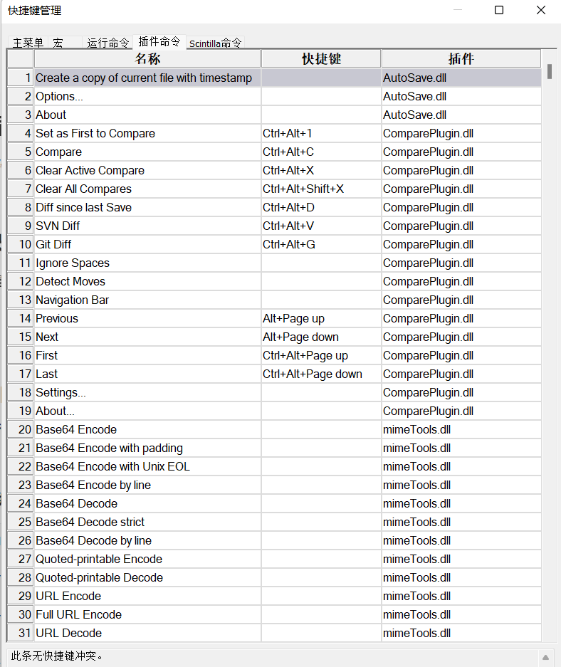
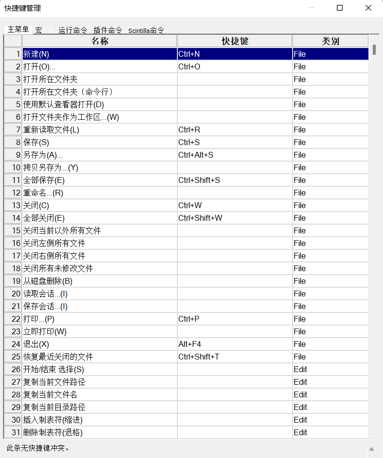
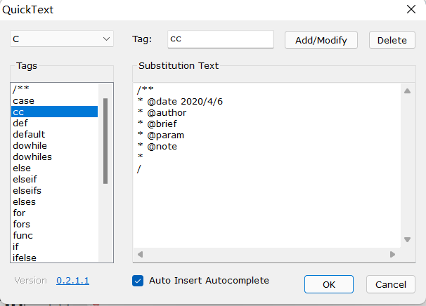

### 插件安装

插件-插件管理


### 快捷键

设置-管理快捷键

         


### NppExec

运行命令行命令的插件


**cc编译c文件**

```
NPP_SAVE

//编译c/c++自动侦测后缀名

//关闭同名exe,删除当前目录同名exe和.o文件

cd "$(CURRENT_DIRECTORY)"

NPP_RUN cmd /c taskkill /f /t /im "$(NAME_PART).exe"

NPP_RUN cmd /c del /f /q *.o

NPP_RUN cmd /c del /f /q "$(NAME_PART).exe"


//设置头文件，库文件
//set $(include)=-I$(NPP_DIRECTORY)\mingw64\include 
//set $(lib)= -L$(NPP_DIRECTORY)\mingw64\lib -lgraphics64 -lgdi32 -limm32 -lbass -lmsimg32 -lole32 -loleaut32 -lwinmm -lcomctl32 -luuid -lws2_32 -lwsock32
//-lwinmm链接winapi库
// flag编译参数:
// [-Wall编译警告][-mconsole 控制台][-mwindows视窗][-g调试模式]
//选择是否加入图标资源
//set $(res)="$(CURRENT_DIRECTORY)\$(NAME_PART).res"
//.c文件调用gcc编译。.cpp文件调用g++编译。
//cls

 

IF $(EXT_PART)==.c THEN

  gcc -Wall -g -mwindows -mconsole "$(CURRENT_DIRECTORY)\$(FILE_NAME)" -o "$(CURRENT_DIRECTORY)\$(NAME_PART).exe"
​    if "$(EXITCODE)"=="0" then
​    echo gcc -Wall -g -mwindows -mconsole "$(FULL_CURRENT_PATH)" -o "$(CURRENT_DIRECTORY)\$(NAME_PART).exe"
​    echo "sucess!编译成功"
​    else
​    cmd /c echo "编译失败"
​    endif


ELSE IF $(EXT_PART)==.cpp THEN

  g++ -Wall -g -mwindows -mconsole "$(FULL_CURRENT_PATH)" -o "$(CURRENT_DIRECTORY)\$(NAME_PART).exe"
  
​    if "$(EXITCODE)"=="0" then
​    cls
​    echo g++ -Wall -g -mwindows -mconsole "$(FULL_CURRENT_PATH)" -o "$(CURRENT_DIRECTORY)\$(NAME_PART).exe"
​    echo "sucess!编译成功"
​    else
​    cmd /c echo "编译失败"
​    //con_colour bg=0 fg=0
​    endif

ELSE
  cls
  echo "错误的后缀名,支持.c和.cpp后缀并注意小写"
  con_colour bg= 0 fg= 0
ENDIF

cd "$(CURRENT_DIRECTORY)"
```


**javac java编译** 

```
NPP_SAVE 

cd "$(CURRENT_DIRECTORY)"

javac "$(FULL_CURRENT_PATH)"
java "$(NAME_PART)"
```


 **m运行m文件** 

```
NPP_SAVE 

cd "$(CURRENT_DIRECTORY)"
matlab -nodesktop -nodisplay -r  \""$(NAME_PART)"\"
```


**make 运行Makefile文件** 

```
NPP_SAVE 

cd "$(CURRENT_DIRECTORY)"

make -f  "$(FULL_CURRENT_PATH)"
```


**py运行python文件** 

```
NPP_SAVE 

cd "$(CURRENT_DIRECTORY)"

python "$(FULL_CURRENT_PATH)"
```


**Notepad++编辑中文的时候，超不方便，出现空格就会自动换行** 

我也遇到了这个问题，在官方论坛上找到了这个问题的一种解决方法。

开启SC_WRAP_CHAR，装nppexec这个插件，运行

```
sci_sendmsg SCI_SETWRAPMODE SC_WRAP_CHAR

npp_console 0
```

来自 <https://zhidao.baidu.com/question/199395736219694685.html> 

 

### Quicktext

自动补全插件

 


