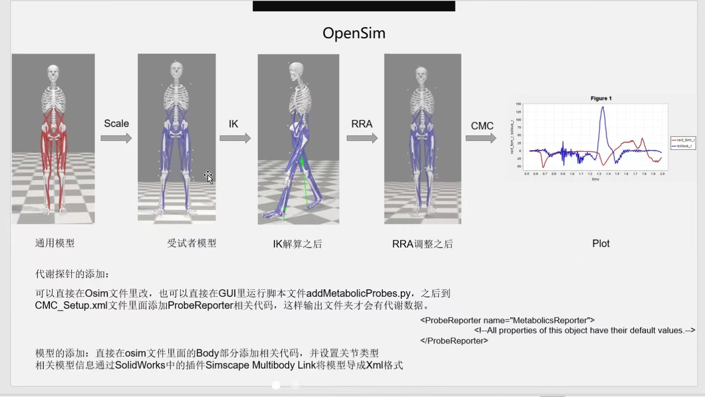
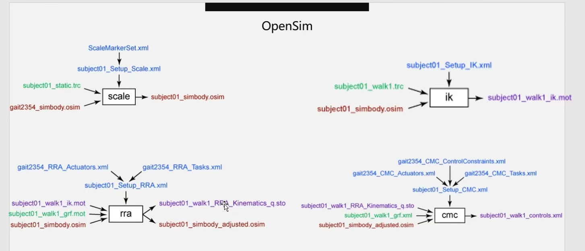
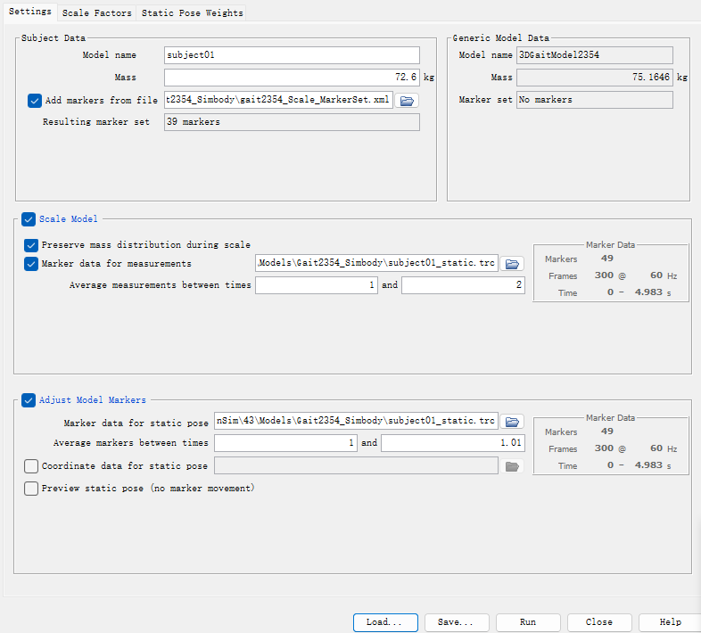
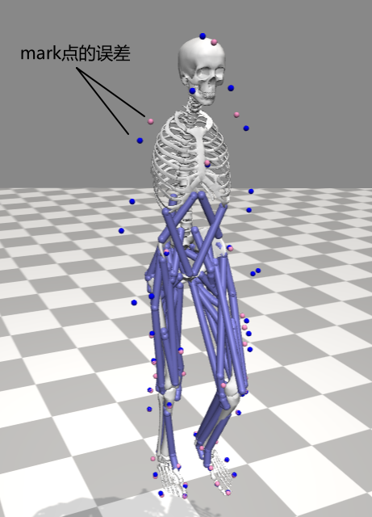
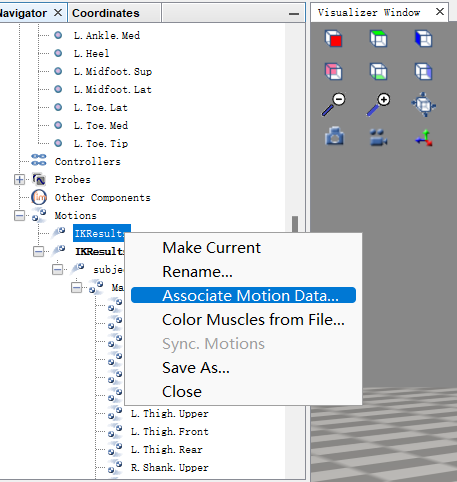
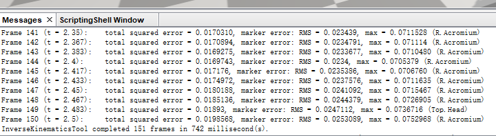
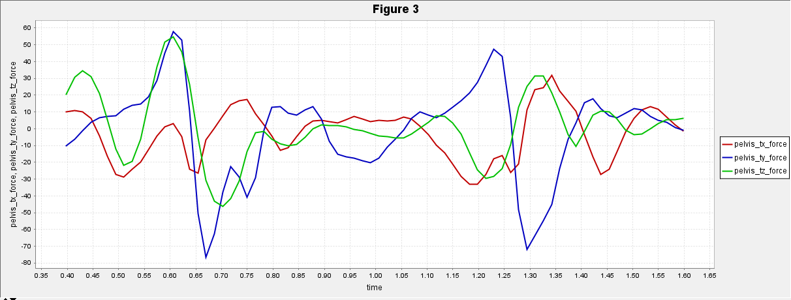
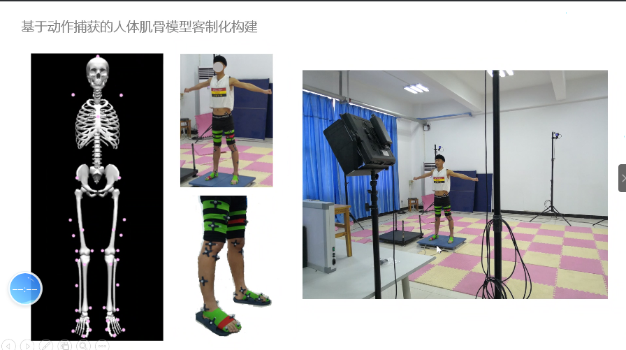

 

### Opensim 

主要的功能：采集人体动作，逆运动学计算肌肉的激活程度。

### Pipline 

### 核心算法：

**Scale Generic Model - 模型缩放**。 OpenSim常采用某一个人的身高、体重数据以及肌肉特征数据建立通用模型，要得到个体化的模型就需要对通用模型进行缩放。模型缩放以实验室测试标记点数据为依据，根据实验数据与通用模型中人体环节点之间的比例，对各环节的长度和质量进行缩放。在缩放过程中，用最小二乘法控制实验中标记点与模型中理论点之间的误差。

**IK (Inverse Kinematics)** - 根据人体期望动作，计算出各个关节空间的运动轨迹。纯运动学模型。

**RRA (Residual Reduction Algorithm)** - 在没有肌肉的情况下，模型的骨架能用来生成与地面反作用力一致的质量分布和关节运动学。动力学模型。

**CMC (Computed Muscle Control)** - 迭代优化肌肉的力输出，使动态肌肉骨骼模型产生的人体关节运动轨迹趋近于期望的人体动作。它通过比例微分（PD）控制和[静态优化](https://simtk-confluence.stanford.edu/display/OpenSim/Working+with+Static+Optimization)的组合实现。肌肉骨骼模型。

图 缩放/ 逆运动学操作/RRA操作/ CMC 操作需要的数据和配置文件

**缩放三维模型要求：**  

 

Input - marker file - *.trc,  *.xml; 

`*.trc`  静态站立情况下采集到的数据光标记点轨迹。information including experimental marker positions. 例如 Gait2354 model的 [01static.trc](..\..\..\..\Software\OpenSim\43\Models\Gait2354_Simbody\subject01_static.trc)  

`*.xml`  配置文件.  例如 [01SetupScale.xml](..\..\..\..\Software\OpenSim\43\Models\Gait2354_Simbody\subject01_Setup_Scale.xml)  [Scale_MarkerSet.xml](..\..\..\..\Software\OpenSim\43\Models\Gait2354_Simbody\gait2354_Scale_MarkerSet.xml)  

Output - *.osim 

`*.osim` - [gait2354_simbody_scaled.osim](..\..\..\..\Software\OpenSim\43\Models\Gait2354_Simbody\gait2354_simbody_scaled.osim)   缩放后的人体骨骼模型 

[理论 How Scaling Works](https://simtk-confluence.stanford.edu:8443/display/OpenSim/How+Scaling+Works)   [实践操作 - III.Scaling A Musculoskeletal Model](https://simtk-confluence.stanford.edu:8443/display/OpenSim/Tutorial+3+-+Scaling%2C+Inverse+Kinematics%2C+and+Inverse+Dynamics) 

**逆运动学：** 输入marker坐标轨迹，输出关节转角轨迹。

          

 

图 蓝色的为实验记录的motion data数据追踪点，红色的为逆运动学模型计算得到的数据点；两者存在误差是正常的。具体误差见下图 messages一栏，最大误差为R.Acromium(肩峰)点，即图中显示的点，误差为7.5cm。

Input - *.xml, *.trc。

`*.osim` - opensim 肌肉骨骼模型 [gait2354_simbody_scaled.osim](..\..\..\..\Software\OpenSim\43\Models\Gait2354_Simbody\gait2354_simbody_scaled.osim)    

`*.xml` -  逆运动学计算配置文件 [subject01_Setup_IK.xml](..\..\..\..\Software\OpenSim\43\Models\Gait2354_Simbody\subject01_Setup_IK.xml) 

`*.trc` -  实际试验采集的数据点轨迹  [subject01_walk1.trc](..\..\..\..\Software\OpenSim\43\Models\Gait2354_Simbody\subject01_walk1.trc)  

output - \*.mot 

`*.mot` - 人体关节端的角度轨迹数据 [subject01_walk1_ik.mot](..\..\..\..\Software\OpenSim\43\Models\Gait2354_Simbody\subject01_walk1_ik.mot)  

`*.sto` - IK的误差数据 [subject01_ik_marker_errors.sto](..\..\..\..\Software\OpenSim\43\Models\Gait2354_Simbody\subject01_ik_marker_errors.sto) 

**动力学分析 ID**

图 动力学分析时会引入一个 residual force，这个力是不存在的，引入的目的是为了防止采集数据的误差导致牛顿第二定律失效， 该值越小越好。该虚拟力作用在pelvis上，如图所示，该力最大可达70N以上。

Input - *.xml, *.mot

`*.xml` -  逆动力学配置文件.   [01_Setup_ID.xml](..\..\..\..\Software\OpenSim\43\Models\Gait2354_Simbody\subject01_Setup_InverseDynamics.xml)   [01_walk1_grf.xml](..\..\..\..\Software\OpenSim\43\Models\Gait2354_Simbody\subject01_walk1_grf.xml)  

`*.mot` -  试验采集的数据点。足底反力以及关节轨迹(上一步的结果) [subject01_walk1_grf.mot](..\..\..\..\Software\OpenSim\43\Models\Gait2354_Simbody\subject01_walk1_grf.mot)   [subject01_walk1_ik.mot](..\..\..\..\Software\OpenSim\43\Models\Gait2354_Simbody\subject01_walk1_ik.mot) 

*\_RRA_Actuators.xml 为使得RRA 收敛速度更快；\*\_grf.xml 力台的数据；\*\_ik.mot 运动学逆解结果；\*RRA_Tasks.xml 求解任务; \*\_Contrainted_RRA_Actuators.xml 算法内部的限制配置文件；\*\_setup_RRA.xml RRA算法器配置文件 

Output - *.sto

`*.sto` - 关节端计算出的力矩数据  [inverse_dynamics.sto](..\..\..\..\Software\OpenSim\43\Models\Gait2354_Simbody\ResultsInverseDynamics\inverse_dynamics.sto)  

**RRA 残差缩减**  

Input - *.xml, *.mot

 `*.xml` -  setup file for the RRA Tool, which specifies settings, inputs, and outputs that affect the behavior of the residual reduction algorithm,  which can be defined using the GUI or by hand.  [01_Setup_RRA.xml](..\..\..\..\Software\OpenSim\43\Models\Gait2354_Simbody\subject01_Setup_RRA.xml)   [RRA_Tasks.xml](..\..\..\..\Software\OpenSim\43\Models\Gait2354_Simbody\gait2354_RRA_Tasks.xml)   [RRA_Actuators.xml](..\..\..\..\Software\OpenSim\43\Models\Gait2354_Simbody\gait2354_RRA_Actuators.xml) (Ideal joint actuators used to replace muscles.)    [01_walk1_grf.xml](..\..\..\..\Software\OpenSim\43\Models\Gait2354_Simbody\subject01_walk1_grf.xml)(包含足底反力 subject01_walk1_grf.mot)

`*.mot` -  试验采集的数据点。关节轨迹(上一步IK的结果) [subject01_walk1_ik.mot](..\..\..\..\Software\OpenSim\43\Models\Gait2354_Simbody\subject01_walk1_ik.mot) 

`*.osim` - opensim model 需要进行RRA计算的模型 [gait2354_simbody_scaled.osim](..\..\..\..\Software\OpenSim\43\Models\Gait2354_Simbody\gait2354_simbody_scaled.osim) 

Output - *.osim，\*.sto, \*.xml

`*.sto` - RRA计算结果的各种数据。 

 [subject01_walk1_RRA_states.sto](..\..\..\..\Software\OpenSim\43\Models\Gait2354_Simbody\ResultsRRA\subject01_walk1_RRA_states.sto) (Adjusted kinematics (i.e., joint angles) and corresponding model states of the simulated motion (i.e., joint angles AND velocities)).  [01_walk1_RRA_Actuation_*.sto](..\..\..\..\Software\OpenSim\43\Models\Gait2354_Simbody\ResultsRRA\subject01_walk1_RRA_Actuation_force.sto) (修改后模型的驱动器端数据)   [01_walk1_RRA_Kinematics*.sto](..\..\..\..\Software\OpenSim\43\Models\Gait2354_Simbody\ResultsRRA\subject01_walk1_RRA_Kinematics_q.sto) (adjusted Joint angles, velocities, and accelerations)

`*.txt` -  [01_walk1_RRA_avgResiduals](..\..\..\..\Software\OpenSim\43\Models\Gait2354_Simbody\ResultsRRA\subject01_walk1_RRA_avgResiduals.txt)(残余应力的值，是ID的50%-70%)  

`*.xml` -  [subject01_walk1_RRA_controls.xml](..\..\..\..\Software\OpenSim\43\Models\Gait2354_Simbody\ResultsRRA\subject01_walk1_RRA_controls.xml) (Actuator excitations, control signals needed to generate actuator forces and torques)

`*.osim` -  [subject01_simbody_adjusted.osim](..\..\..\..\Software\OpenSim\43\Models\Gait2354_Simbody\subject01_simbody_adjusted.osim)(optional): A model with adjusted mass properties.

[理论 How RRA Works](https://simtk-confluence.stanford.edu:8443/display/OpenSim/How+RRA+Works)   

**CMC 肌肉计算控制** input CMC_Actuator.xml；\*\_grf.xml 力台的数据；\*\_ik.mot 运动学逆解结果；\*CMC_Tasks.xml 求解任务; 

### 自制/缩放骨骼模型

需要测力板（力台），测量人体的足底压力，便于计算肌肉激活程度。

如何贴 marker 点，减少误差很重要的

### 论坛教程

[Modeling, Evaluation, and Control Optimization of Exosuit with OpenSim](https://simtk-confluence.stanford.edu:8443/display/OpenSim/Modeling%2C+Evaluation%2C+and+Control+Optimization+of+Exosuit+with+OpenSim) 

[Simulation-based soft exosuit design](https://simtk-confluence.stanford.edu:8443/display/OpenSim/Simulation-based+soft+exosuit+design) 

[Modeling Bilateral Hip-Knee-Ankle Exoskeleton Assistance](https://simtk-confluence.stanford.edu:8443/display/OpenSim/Modeling+Bilateral+Hip-Knee-Ankle+Exoskeleton+Assistance) 

### CSDN 教程

[CSDN  OpenSim教程三——使用OpenSim辅助开发减少行走代谢值的可穿戴式设备](https://blog.csdn.net/lrm15659833890/article/details/78046605?utm_medium=distribute.pc_relevant.none-task-blog-BlogCommendFromBaidu-6.not_use_machine_learn_pai&depth_1-utm_source=distribute.pc_relevant.none-task-blog-BlogCommendFromBaidu-6.not_use_machine_learn_pai)

 

