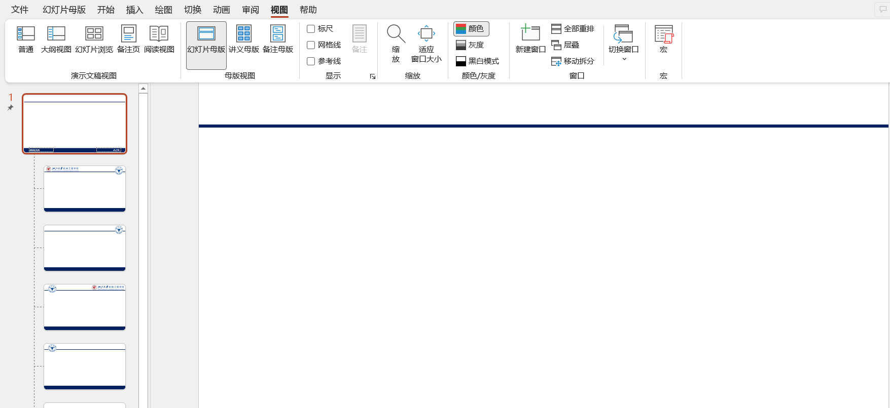
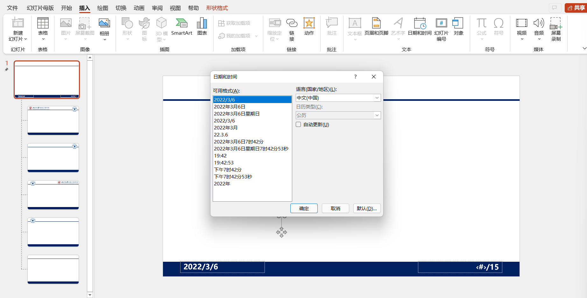
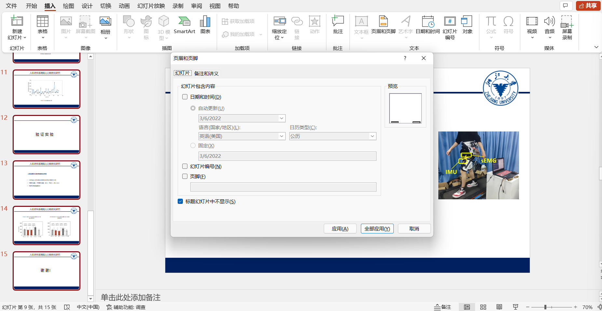

 

### 插入日期和PPT页码

1.修改幻灯片母版

  

图 幻灯片母版

2.先插入一个文本框，然后点击 **日期和时间**  ，会赋予每一张新建的幻灯片一个宏，用于更新时间

 

2.先插入一个文本框，然后点击 **幻灯片编号** ，会赋予每一张新建的幻灯片一个宏，用于计算编号

注意，总页数只能手动输入，然后复制。

如果要实现自动，非常复杂，可以参考知乎 [在PPT中如何自动生成总页数?](https://www.zhihu.com/question/64749993) 

3.退出母版，然后全选幻灯片，插入-幻灯片编号，**先去掉幻灯片编号全部应用，然后再选上全部应用，实现更新**

**注意：**每次修改母版，可能就得更新一下；

  