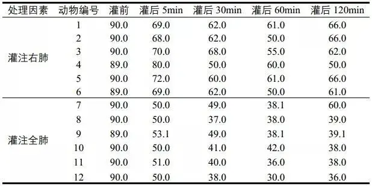

### SPSS 两两比较

方差不齐的时候，可以有多种方式进行两两比较

1. 方差不齐的 **t 检验** / **方差检验**
2. 变量转换后使用普通 **t 检验** / **方差检验**
3. **非参数分析**

非正态的时候，可以有多种方式进行两两比较

1. 对所有数据非线性转换后，若所有数据都转为正态，可使用**普通 t 检验 / 方差检验**
2. **非参数分析**

  

————————————————

https://www.jianshu.com/p/75c32e1dac78

### 数据预分析

#### 正态分布检验

* Jarque-Bera  tests

* **Shapiro-Wilk tests** 

  适合小样本情况下， 200~2000以下

  [论文](https://doi.org/10.1186/s12984-023-01212-w) 使用此方法.

* **Kolmogorov-Smirnov test** 

  适合大样本情况下， 200~2000以上

  `分析 - 统计描述 - 探索` 可进行 `Kolmogorov-Smirnov test `和 `Shapiro-Wilk test` 

  `分析 - 非参数检验- 旧 - 1样本K-S` 可进行 `Kolmogorov-Smirnov test `

### 方差分析 (One way ANOVA)

> 用于两两比较，用于判断一个变量是否影响另一个变量

#### 假定方差齐次性`

方差分析 (One way ) ：LSD  / Bonferroni / S-N-K ...

**要求** ： `正态分布`, `假定方差齐次性`, `变量独立性`, `各个组别样本量相差不大` 。

**特点**： 独立 T 分析进行两两比较时，会使得每组的第一类错误率累计起来，最后会产生远大于`0.05`的一类错误率。所以切忌使用T分析，此时方差分析就可以完美的对不同的组别两两比较。 

**比较对象**：两两组别的均值显著性比较。

    LSD法
    即最小显著差法(Least Significance Difference Method)，是最简单的比较方法之一。
    用t检验完成各组均值间的配对比较，对多重比较误差率不进行校正。
    
    Sidak法
    实际上是Sidak校正在LSD法上的应用。
    用t检验完成各组均值间的配对比较，对多重比较误差率进行校正。
    Sidak法比LSD法保守得多。
    
    Bonferroni法
    实际上是Bonferroni校正在LSD法上的应用
    用t检验完成各组均值间的配对比较，对多重比较误差率进行校正
    Bonferroni法比Sidak法保守一些。
    
    Scheffe法
    对多组均数间的线性组合是否为0进行检验，即(Contrast)
    
    Dunnett法
    常用于多个实验组与一个对照组间的比较
    设定此法后，激活Control Category 参数框，展开小菜单，选择对照组。 

多个实验组与一个对照组的比较，一般采用Dunnett法。

需要进行任意两组间的比较而各组样本含量相同，选用Tukey法。

需要进行任意两组间的比较而各组样本含量不相同，选用Scheffe法。

https://blog.csdn.net/liuyuan_jq/article/details/51946655

#### 假定方差不齐次性`

Tamhane's T2 / Dunnett's T3 / Games-Howell / Dunnett's C

**要求** ： `正态分布`，`变量独立性`，`各个组别样本量相差不大` 。

如果方差不齐时，一般都选Dunnett's T3。

    Tamhane’s T2 基于 t 检验的保守成对比较。当方差不相等时，适合使用此检验。
    
    Dunnett’s T3 基于学生化最大值模数的成对比较检验。当方差不相等时，适合使用此检验。
    
    Games-Howell 当方差不相等时的一种比较灵活的配对比较。
    
    Dunnett’s C 基于学生化范围的成对比较检验。当方差不相等时，适合使用此检验。
————————————————

https://blog.csdn.net/liuyuan_jq/article/details/51946655

**多组数据差异性分析，其中既有符合正态分布的，也有不符合正态分布的，该用什么检验方法呀？** 

https://www.zhihu.com/question/438589529

使用log等非线性函数变换数据，使得数据符合正态分布；或者如果数据量大直接用非参数比较。

#### 理论分析与SPSS操作

[csdn 网址](https://blog.csdn.net/liuyuan_jq/article/details/51946655?utm_medium=distribute.pc_relevant.none-task-blog-2%7Edefault%7EBlogCommendFromMachineLearnPai2%7Edefault-3.control&depth_1-utm_source=distribute.pc_relevant.none-task-blog-2%7Edefault%7EBlogCommendFromMachineLearnPai2%7Edefault-3.control) 

### 方差分析 (two way ANOVA)

https://www.scribbr.com/statistics/two-way-anova/

> 用于判断是否两个独立的变量 *共同作用  interaction effect*  会影响 另一个独立的变量。譬如，肥料类型和种植密度是否共同影响产量。
>
> $Z = f(X,Y) = h(X)+ g(Y) + XY + X^2Y+XY^2 + ...$ 
>
> A two-way ANOVA is used to estimate how the[ mean](https://www.scribbr.com/statistics/mean/) of a [quantitative variable](https://www.scribbr.com/methodology/types-of-variables/) changes according to the levels of two categorical variables. Use a  two-way ANOVA when you want to know how two independent variables, in  combination, affect a dependent variable.

> Example
>
> You are researching which type of fertilizer and planting density produces  the greatest crop yield in a field experiment. You assign different  plots in a field to a combination of fertilizer type (1, 2, or 3) and  planting density (1=low density, 2=high density), and measure the final  crop yield in bushels per acre at harvest time.
>
> You can use a two-way ANOVA to find out if fertilizer type and planting density have an [effect](https://www.scribbr.com/commonly-confused-words/affect-vs-effect/) on average crop yield.
>
> 

### 重复测量方差分析

> 重复测量方差分析最核心的功能是研究指标是否随着时间的变化而变化（time）
>
> 重复测量的方差分析很重要的一点是检验“时间效应”，即不同的时间点测量的数据是否有差异。把时间效应看做一个特殊的自变量，而且它有一个专门的名字，叫within-Subject Factor，一般直译为“受试者内因素”

> 案例  https://zhuanlan.zhihu.com/p/190969151

> 
>
> 可以得出结论 
>
> 1） 时间效应（time）具有统计学意义：即灌注海水后，犬肺的氧分压会随着灌注的时间的延长而逐渐下降，到灌注后60min达到最低；
>
> 2）交互效应（time*group）具有统计学意义：随着灌注时间的延长，单肺灌注与全肺灌注氧分压下降的幅度不同，从图形上看就是，直线的斜率不同，全肺灌注的犬氧分压下降幅度大（直线更陡峭）
>
> 3）单独组间效应（group）具有统计学意义：此处SPSS对多个因变量进行了数据变换，从而进行单变量方差分析，结果显示P<0.05，表明灌注部位会影响氧分压。

 

球形检验：Mauchly's sphericity test

### 非参数分析

> 平时我们常用的t检验、卡方检验、方差分析等方法都要求样本服从特定的分布（比如t检验要求样本服从正态分布），这些方法被称为参数检验方法。但有些数据并不符合参数检验的要求，最常见的情况是数据不符合正态分布，这时可以使用非参数检验的方法。

5种非参数检验方法的SPSS操作教程 https://www.mediecogroup.com/zhuanlan/lessons/980/

[两独立样本：Mann-Whitney U检验（简洁版）](http://mp.weixin.qq.com/s?__biz=MzI2OTQyMzc5MA==&mid=2247484048&idx=1&sn=664d750dd5d5f08bd2a1eb278a2b1715&chksm=eae1c751dd964e479f8ed8f3de7af4d5c5f8db0163176e867f81826cddb6bdfdf7598fd2e9ed&scene=21#wechat_redirect)

详细介绍见  [How the Mann-Whitney test works](SPSS.assets\How the Mann-Whitney test works.md)  

[配对样本：Wilcoxon符号秩检验 (简洁版)](https://www.mediecogroup.com/zhuanlan/lessons/126/)

[多个独立样本：Kruskal-Wallis H检验 (简洁版)](https://www.mediecogroup.com/zhuanlan/lessons/165/)

[多个相关样本：Friedman检验](https://www.mediecogroup.com/zhuanlan/lessons/145/)

[Friedman Test](https://www.statstest.com/friedman-test/#:~:text=The%20Friedman%20Test%20is%20a%20statistical%20test%20used,and%20have%20a%20similar%20spread%20across%20your%20groups.z) is used to determine if 3 or more measurements from the same group of  subjects are significantly different from each other on a skewed  variable of interest.

[多个相关样本：Cochran's Q检验](https://www.mediecogroup.com/zhuanlan/lessons/308/)

