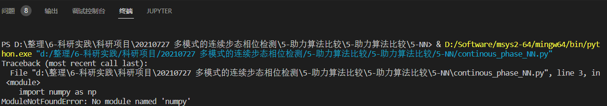
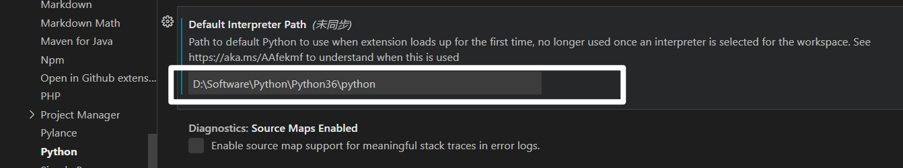
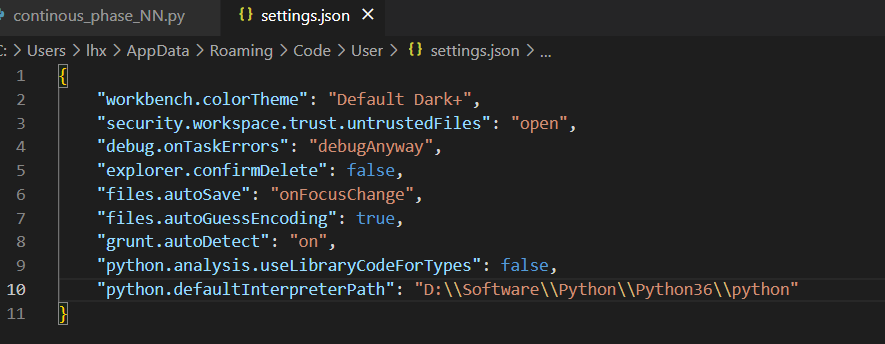
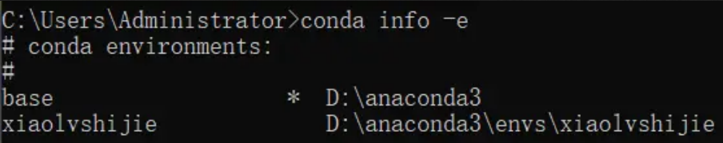
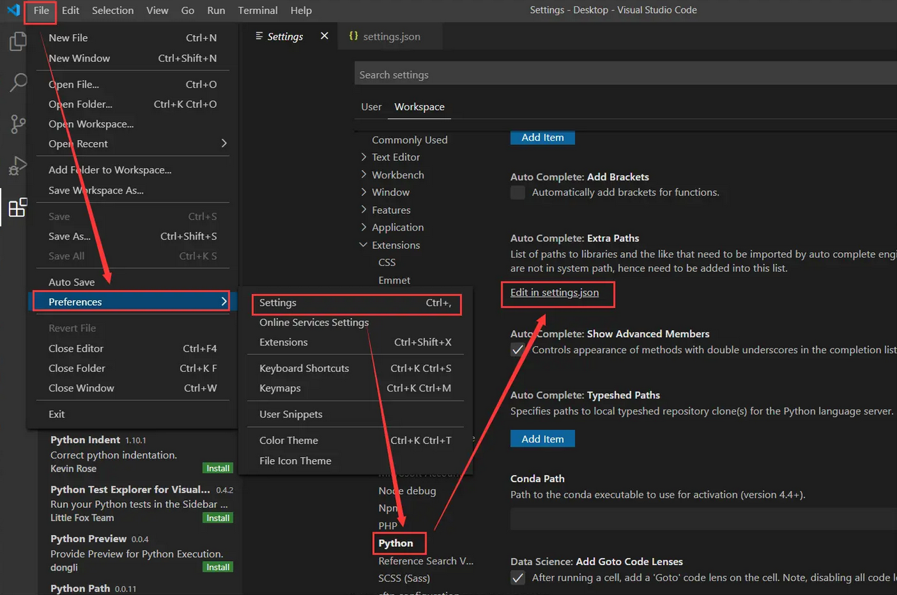
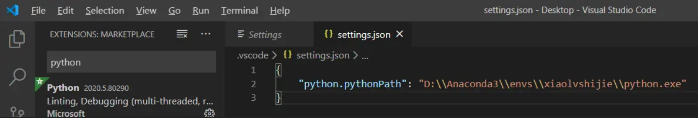
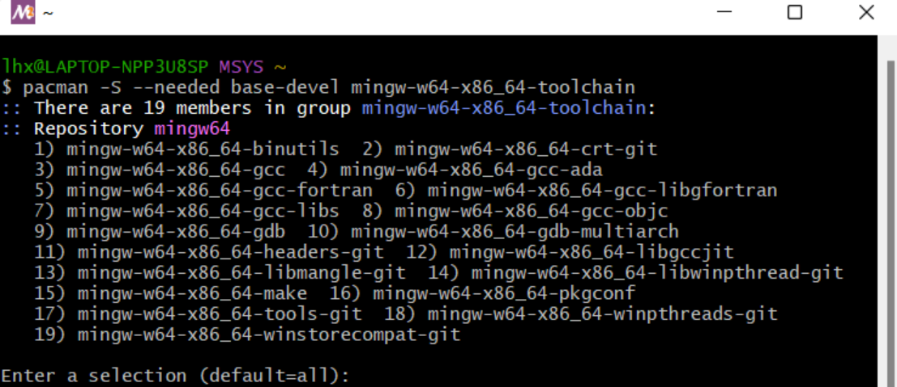
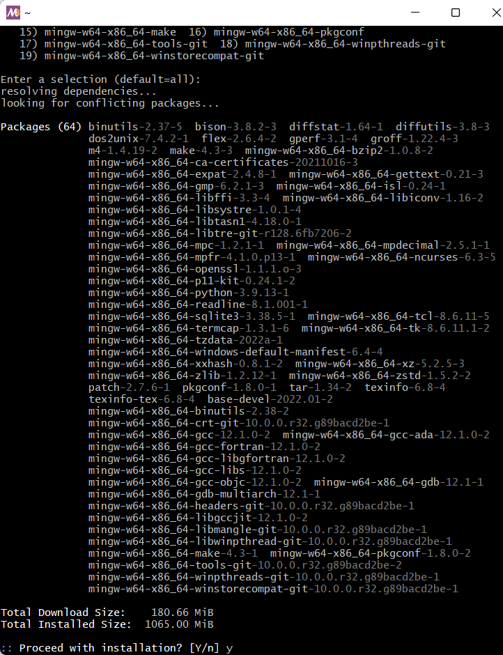
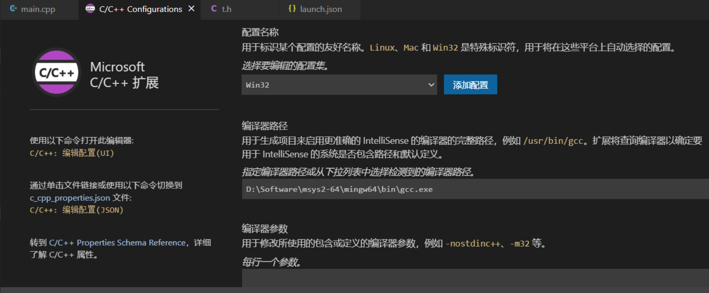
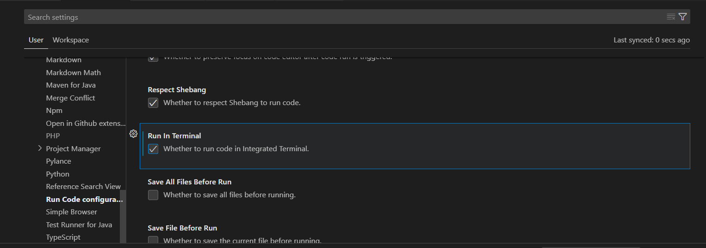

# Python

### python 找不到对应库

可以查看终端中显示的python.exe是不是你安装了库对应的python地址



如果不是，再 `文件 - 首选项 - 设置` 中输入对应的解释器文件所在地址



json配置文件，就会增加一行解释器地址




### 指定 python 环境

确定当前激活环境所在路径




然后在`File-->Preferences-->Settings-->Extensions-->Python-->setting.json`添加下面的 Python 路径，这个路径和你设置的环境名称有关。

```
"python.pythonPath" :"D:\\anaconda3\\envs\\xiaolvshijie\\python.exe"
```







# C++ & C

 

  


 


多文件编译需要使用到json配置文件，并且 debug要求路径无中文.

task.json  用于生成 exe文件

```
{
    "tasks": [
        {
            "type": "cppbuild",
            "label": "C/C++: g++.exe build active file",
            "command": "D:/Software/msys2-64/mingw64/bin/g++.exe",**gcc安装位置，需要确认**
            "args": [
                "-fdiagnostics-color=always",
                "-g",
                "${fileDirname}\\*.cpp",		**多文件这一行需要手动修改**
                "-o",
                "${fileDirname}\\${fileBasenameNoExtension}.exe"  **exe文件生成**
            ],
            "options": {
                "cwd": "${fileDirname}"
            },
            "problemMatcher": [
                "$gcc"
            ],
            "group": {
                "kind": "build",
                "isDefault": true
            },
            "detail": "Task generated by Debugger."
        }
    ],
    "version": "2.0.0"
}
```


launch.json

```
{
    "version": "0.2.0",
    "configurations": [
        {
            "name": "C/C++",
            "type": "cppdbg",
            "request": "launch",
            "program": "${fileDirname}\\${fileBasenameNoExtension}.exe",
            "args": [],
            "stopAtEntry": false,
            "cwd": "${workspaceFolder}",
            "environment": [],
            "externalConsole": false,
            "MIMode": "gdb",
            "miDebuggerPath": "gdb.exe",
            "preLaunchTask": "compile",
            "setupCommands": [
                {
                    "description": "Enable pretty-printing for gdb",
                    "text": "-enable-pretty-printing",
                    "ignoreFailures": true
                }
            ],
        },
    ]
}
```


# Java


插件配置


File - Preferences - setting - extension



