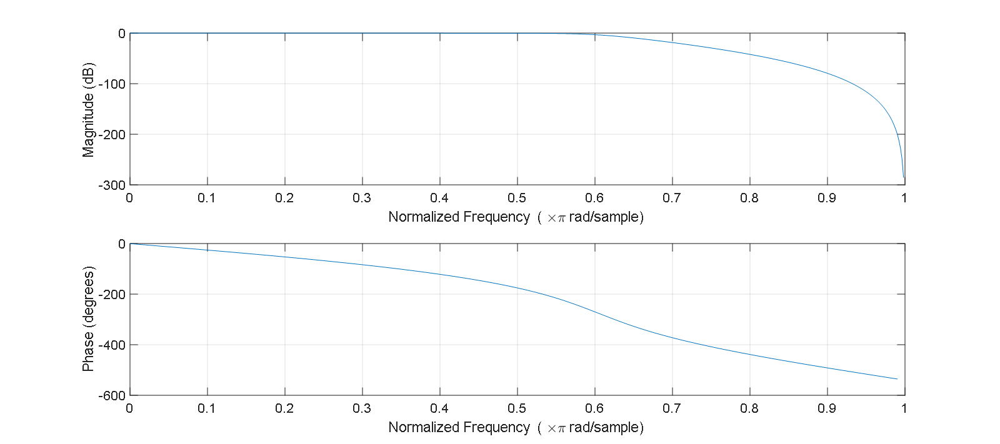
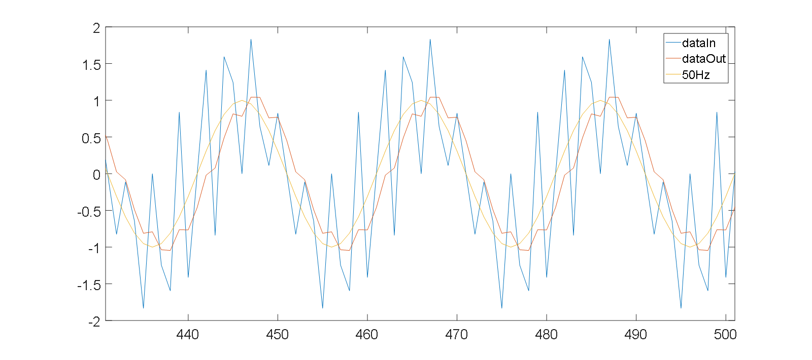
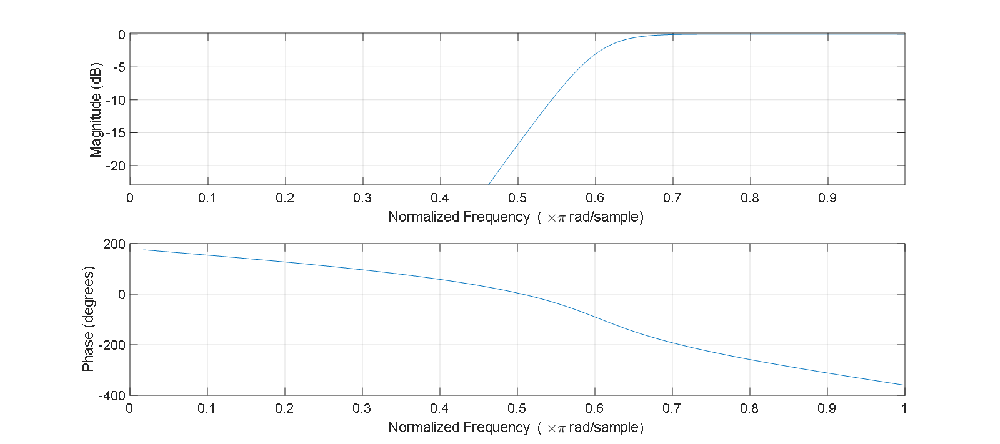
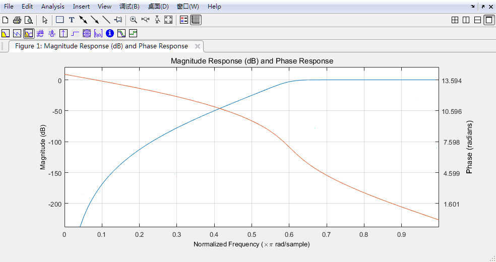
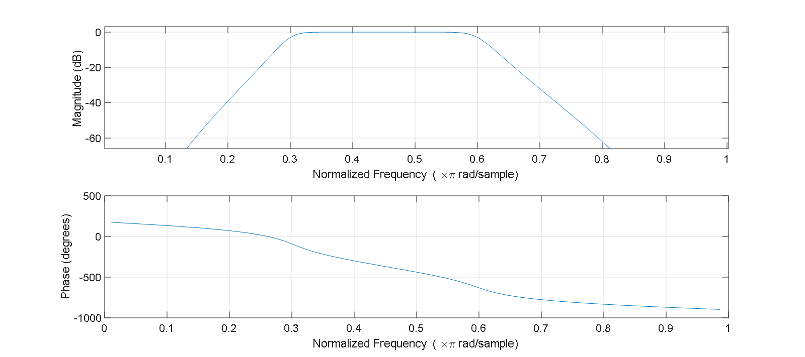
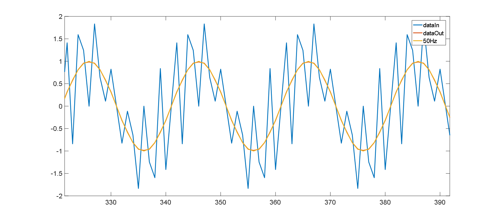

### butter 巴特沃斯

#### 低通滤波器

```matlab
fc = 300;			% 截止频率
fs = 1000;			% 采样频率

% 6阶巴特沃斯低通滤波器，输入的是归一化的截止频率 fc/(fs/2) π*rad/sample
[b,a] = butter(6,fc/(fs/2));

% 输入信号 400Hz+50Hz+350Hz, 尝试滤除 400Hz/350Hz
dataIn = 0.5*sin(pi*800*(0:1/fs:1))+sin(pi*100*(0:1/fs:1))+sin(pi*700*(0:1/fs:1));	
dataOut = filter(b,a,dataIn);	% 滤波后信号
plot(dataIn);hold on;plot(dataOut);plot(sin(pi*100*(0:1/fs:1)))
legend({'dataIn', 'dataOut', '50Hz'})

freqz(b,a)  					% 查看滤波器频谱
% ltiview，也可以查看
```



图 freqz(b,a)  结果，截止频率 0.6



图 低通滤波效果


#### 高通滤波器

```matlab
% 6阶巴特沃斯高通滤波器，输入的是归一化的截止频率 fc/(fs/2) π*rad/sample
[b,a] = butter(6,fc/(fs/2), 'high');

dataIn = randn(1000,1);			% 输入信号
dataOut = filter(b,a,dataIn);	% 滤波后信号
freqz(b,a)  					% 查看滤波器频谱
% ltiview，也可以查看

```



```matlab
%% 
% Specify a cutoff frequency of 300 Hz, which, for data sampled at 1000 Hz, corresponds to 0.6 π*rad/sample. 
[z,p,k] = butter(9,300/500,'high');
sos = zp2sos(z,p,k);
fvtool(sos,'Analysis','freq')
```




#### 带通滤波器

```matlab
fc1 = 300;			% 截止频率
fc2 = 600;			% 截止频率
fs = 2000;			% 采样频率

% 6阶巴特沃斯带通滤波器，输入的是归一化的截止频率 fc/(fs/2) π*rad/sample
[b,a] = butter(6, [fc1/(fs/2), fc2/(fs/2)]);
freqz(b,a)  
```




### 卡尔曼滤波

 [kalman_filter.m](matlab滤波.assets\kalman_filter) 


### 无延迟滤波

filtfilt() 与 filter(b,a,dataIn) 用法相同

运行 上述 butter 低通滤波器相同代码（**% 输入信号 400Hz+50Hz+350Hz, 尝试滤除 400Hz/350Hz**），两者比较可以看出 filtfilt() 更加优秀 ——无延时，滤波效果也更好

 

​                图 filtfilt (b,a,dataIn)  效果;

 

​                图 filter (b,a,dataIn)  效果;

