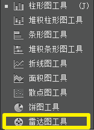
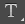
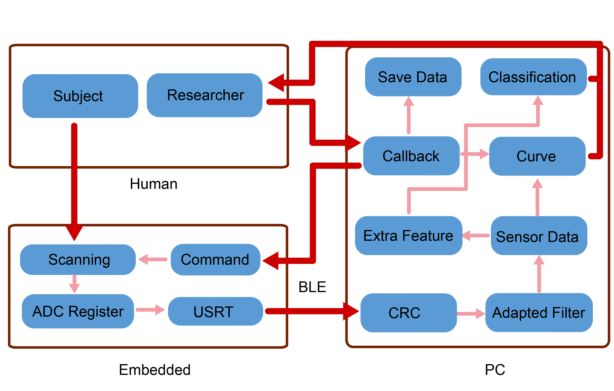

### 0. 功能

Illustrator，常被称为“AI”，是一种应用于[出版](https://baike.baidu.com/item/出版/285005)、[多媒体](https://baike.baidu.com/item/多媒体/140486)和在线图像的**工业标准矢量插画**的软件。

能够导入编辑 Matlab 绘制的图片，实物图片。


## 1. 快捷键

>  https://www.jb51.net/Illustrator/101660.html 

英文键盘下：


```
V —— 选择工具
A —— 直接选择工具，可以在组合中直接选择部件 还可以直接选择线上的锚点

M —— 方框绘制
H —— 拖动手柄
T —— 输入数字和字体

x -- 切换填色和描边
```


## 2. 常用功能

### 2.1 选择

> 批量修改对象属性时会用到
>
> 譬如： 修改所有的文字的大小，某种文字的字体 等方法


> 选取 group  


> 忽视group选取，可选中锚点  


### 2.2 曲线临摹

> 钢笔工具  

绘制关键锚点，完成路径曲线绘制


> 锚点增加工具  

完成路径曲线绘制后，可通过锚点增加工具去添加一些遗漏的关键帧


> 直接选择工具  

可修改关键锚点的位置，等等属性


### 2.3 几何图形

>  内置的几何图形 


>  线 


> 描边


### 2..4 排版

>  


> 伸缩操作


> 图层  


### 2.5 内置绘图

  


### 2.6 公式绘制

$mathtype$ 复制


### 2.7 颜色选择


> 色板 ，有预定义的色系搭配
>
> Note : 可新建当前选中的填充或者描边的颜色


同样功能：


> 调色板  


> 颜色参考 


### 2.8 字体

> 插入字体  


> 修改字体 


## 3. 论文作图


**biomedical engineering online** 

* All lines should be wider than 0.25 pt 
* Font size should be between 6 and 14.

- width of 85 mm for half page width figure
- width of 170 mm for full page width figure
- maximum height of 225 mm for figure and legend

 [SCI.ai](..\..\10-Chip_learning\0-硬件\3-motor\电机控制项目\助力外骨骼控制\0-论文\SCI\图片\SCI.ai)  

   


