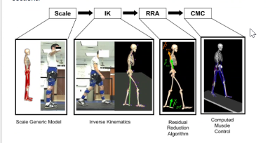
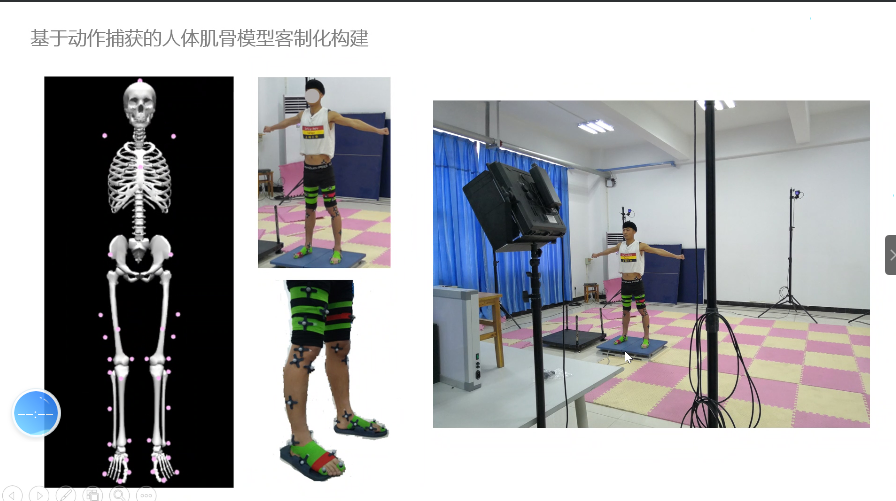

https://blog.csdn.net/lrm15659833890/article/details/78046605?utm_medium=distribute.pc_relevant.none-task-blog-BlogCommendFromBaidu-6.not_use_machine_learn_pai&depth_1-utm_source=distribute.pc_relevant.none-task-blog-BlogCommendFromBaidu-6.not_use_machine_learn_pai

### Opensim 

主要的功能：采集人体动作，逆运动学计算肌肉的激活程度。

### Pipline

### 核心算法：

CMC - 计算肌肉的力输出，使得产生的人体关节运动轨迹趋近于采集到的人体动作

RRA - 

IK - 根据人体动作，计算出各个关节空间的运动轨迹

### 自制/缩放骨骼模型

需要测力板（力台），测量人体的足底压力，便于计算肌肉激活程度。

如何贴 marker 点，减少误差很重要的

**缩放三维模型要求：**  marker file - *.trc,  *.xml；

**逆运动学：** 输入marker坐标轨迹，输出关节转角轨迹。 input - *.xml, *.trc。 output - \*.mot [每个关节的转角]；

**RRA 逆动力学**  input - *\_RRA_Actuators.xml 为使得RRA 收敛速度更快；\*\_grf.xml 力台的数据；\*\_ik.mot 运动学逆解结果；\*RRA_Tasks.xml 求解任务; \*\_Contrainted_RRA_Actuators.xml 算法内部的限制配置文件；\*\_setup_RRA.xml RRA算法器配置文件

**CMC肌肉激活程度计算** input CMC_Actuator.xml；\*\_grf.xml 力台的数据；\*\_ik.mot 运动学逆解结果；\*CMC_Tasks.xml 求解任务; 

