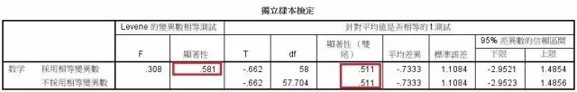

**How the Mann-Whitney test works**

Mann-Whitney检验又叫做秩和检验，是比较没有配对的两个独立样本的非参数检验。思想是这样的：假定要检验两组数据之间有没有差异。首先，不管  分组把所有数据排序。按照数值大小给定一个值叫做秩。最小的值秩为1，最大的为N（假定两个样本总共有N个观察值）。如果有相同的值，就得到相同的秩。相 同的值的秩是他们的秩的平均值。如果两组的秩的和差距比较大，就会得出较小的p值，认为这两组间有显著差异。软件：[spss软件](http://baike.baidu.com/view/637703.htm)，只要输入数据，选择合适的参数，就可以很快得到结果。

**How to think about the results of a Mann-Whitney test**

样本量太小的话效度会很低。比如，如果总的数据只有7个或者更少的话，p值总是大于5%的。**一组样本量必须大于20，即两组样本量之和必须大于40。数据量比较小的话容易造成第二类错误。**

**Is the Mann-Whitney test the right test for these data?**

分析之前要先看一下，Mann-Whitney 检验是否适合手头的问题。

| **问题**                   | **解释**                                                     |
| -------------------------- | ------------------------------------------------------------ |
| “误差”是独立的吗？         | “误差”指的是每个值和中位数的差异。仅当误差的分布是随机的时候Mann-Whitney 检验的结果才有意义。一般要保证独立样本。样本不独立可能会导致误差不随机。 |
| 数据是配对的吗？           | 如果数据是配对的，应该用Wilcoxon成对检验。                   |
| 是只比较两组数据吗？       | Mann-Whitney 检验只用于两组数据的比较。如果要比较多组数据，可以用 Kruskal-Wallis 检验。用几次 Mann-Whitney 检验来比较多个组间的差异是不适合的，就如同ANOVA 不能用多次t检验代替一样。 |
| 两个分布的形状是相同的吗？ | Mann-Whitney 检验不需要假定数据符合某种分布，但是要求两个分布是相同的。如果两组的分布差异比较大，可能需要数据转换使之相近。 |
| 是否比较中位数？           | Mann-Whitney 检验比较的是两组的中位数。                      |
| 数据分布时正态的吗？       | 非参数检验的好处和弱点是不需要假定数据符合某种分布。非参数检验有时候更适合（当数据分布未知时），有时候效度较低（当已知分布时参数检验效度更高）。所以如果数据能够转换为正态分布，t检验将会有更高的效度。 |

#### SPSS 分析 [Mann-Whitney](http://www.datasoldier.net/archives/tag/mann-whitney) U test 结果分析

 

图 [Mann-Whitney](http://www.datasoldier.net/archives/tag/mann-whitney) U test 的结果  

零假设H0：假设是否少数族裔工资水平是相等的。现在P=0.000小于0.05，零假设是小概率事件，拒绝。

综合研究内容，我们说是否少数族裔其工资差异有统计学意义（Z = -3.887，P < 0.01 ）。

#### SPSS 分析独立t检验结果

从结果来看，在Levene方差测试中，显著性为0.581，大于0.05，所以男生和女生的数学成绩是方差齐性的，所以看第一行，T检验的显著性为0.511，大于0.05，表明男生与女生的数学成绩没有显著性差异。**如果在Levene方差测试中，显著性结果小于0.05，则需要看第二行的T检验结果。** 

第二类错误是指在进行[假设检验](https://baike.baidu.com/item/假设检验)时，原[假设](https://baike.baidu.com/item/假设)不正确，然而接受（未能拒绝）原假设的[错误](https://baike.baidu.com/item/错误)。

