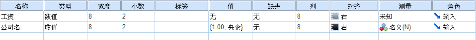
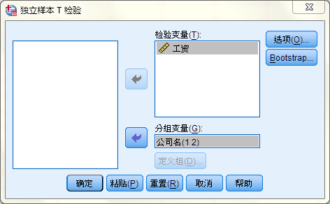

## 0.SPSS介绍

SPSS 全称 Statistical Product and Service Solutions. 

SPSS为[IBM](https://baike.baidu.com/item/IBM/9190)公司推出的一系列用于统计学分析运算、数据挖掘、预测分析和决策支持任务的软件产品及相关服务的总称，有Windows和Mac OS X等版本。其基本功能包括

* 数据管理
  * 描述性统计
  * 均值比较
  * 一般线性模型
  * [相关分析](https://baike.baidu.com/item/相关分析)  
  * [回归分析](https://baike.baidu.com/item/回归分析) 
    * 又分[线性回归](https://baike.baidu.com/item/线性回归)分析、曲线估计、Logistic回归、Probit回归、加权估计、两阶段最小二乘法、非线性回归等多个统计过程，
  * 对数线性模型
  * [聚类分析](https://baike.baidu.com/item/聚类分析)
  * [数据简化](https://baike.baidu.com/item/数据简化)、
  * [生存分析](https://baike.baidu.com/item/生存分析)、
  * [时间序列分析](https://baike.baidu.com/item/时间序列分析)、
  * 多重响应等几大类
* 统计分析
* 图表分析
* 输出管理等等。

**当前使用版本 IBM SPSS Statistics 22.0 - 2013年8月** 

## 1. 数据库建立

### 变量视图

可修改 / 显示 变量名，变量类型等属性

### 变量测量属性

**有序变量**用于描述具有顺序固定的不同值的数据。例如，工资类别或满意度排序可以归类为有序数据。顺序由数据元素的自然排列顺序定义。例如，1, 3, 5 是某个整数集合的默认排列顺序，而 HIGH, LOW, NORMAL（按字母升序）是某个字符串集合的顺序。使用有序测量级别可以将一组分类数据定义为有序数据，以进行可视化处理、模型构建以及导出到将有序数据识别为不同类型的其他应用程序（如 IBM® SPSS® Statistics）。您可以在任何能够使用名义字段的位置使用有序字段。此外，可以将任何存储类型（实数、整数、字符串、日期、时间等等）的字段定义为有序。

`有序变量的示例包括HIGH, LOW, NORMAL（按字母升序）、从十分不满意到十分满意的服务满意度水平、日期、时间` 

**名义变量**用于描述具有多个不同值的数据，其中的每个值都被视为集合的一个成员，如 small/medium/large。名义数据可具有任何存储—数值、字符串或日期/时间。请注意，将测量级别设置为名义不会自动将值更改为字符串存储。

`名义变量的示例包括地区、邮政编码、雇员任职的公司部门和宗教信仰` 

**度量/标度变量**当区间或比率刻度度量的数据，其中数据值既表示值的顺序，也表示值之间的距离。例如，72,195 美元的薪金比 52,398 美元的薪金高，这两个值之间的距离是 19,797 美元。也称为**定量**或**连续数据**。

``度量/标度变量的示例包括算法精度、耗时、价格、工资等` 

### **字段角色设置**

> 字段的角色用于指定其在模型构建过程中的用法 - 例如，字段是输入还是目标（预测的对象）。
>
> 注意：“分区”、“频率”和“记录标识”角色只能分别应用到单个字段。

 

**输入。**字段将用作机器学习的输入（预测变量字段）。

 

**目标**。字段将用作机器学习的输出或目标（模型将尝试预测的字段之一）。

 

**两者。**字段将被 Apriori 节点同时用作输入和输出。所有其他建模节点都将忽略该字段。

 

**无。**机器学习将忽略该字段。测量级别已设置为无类型的字段将在角色列中自动设置为无。

 

**分区。**指明字段用于将数据分区为单独的样本（用于训练、测试，也可用于验证）。该字段必须属于实例化集合类型，具有两个或三个可能值（在“字段值”对话框中定义）。第一个值表示训练样本，第二个值表示测试样本，第三个值（如果存在）表示验证样本。所有其他值都将被忽略，且不能使用标志字段。请注意，要在分析中使用分区，必须在相应的模型构建或分析节点的“模型选项”选项卡中启用分区。启用分区时，会将对于分区字段具有空值的记录从分析中排除。如果已在流中定义多个分区字段，那么必须在每个相应建模节点的“字段”选项卡中指定单一分区字段。如果数据中不存在适合的字段，您可以使用“分区”节点或“派生”节点进行创建。请参阅主题分区节点，了解更多信息。

分割。（仅名义、有序和标志字段）指定为字段的每个可能值构建一个模型。

 

**频率。** （仅数字字段）设置此角色允许将字段值用作记录的频率加权因子。仅 C&R 树、CHAID、QUEST 和线性模型支持此功能；所有其他节点将忽略此角色。在支持此功能的建模节点的“字段”选项卡上，选择使用频率权重以启用频率加权。

 

**记录标识。**此字段将用作唯一记录标识。大多数节点都会忽略此特征；但它受线性模型支持，并且是 IBM Netezza 数据库内挖掘节点所必需的。

原假设 H0， 两组数据相等

第一类错误的概率（假设正确，我们把它拒绝的错误）

第二类错误的概率（假设错误，我们把它接受的错误）

第一类和第二类是一个矛盾体，不可能兼得。

p值 - 等于范第一类错误的概率（假设正确，我们把它拒绝的错误）

## 2. 均值比较

平均值

**检验前操作**

t检验适用于标准差未知的正态分布，

1. 样本数量要求
主要用于样本量较小(10 < n < 30) [ 其实可以更小 ]

2. 数据分布是否是高斯分布的检验方法
分析 - 描述统计 - 探索， 绘图中勾选`待检验的正态图`. 查看正态鉴定表(Test of Normality)，如果显著性高于显著水平(0.05)，那么它就是正态的

3. 方差齐次性
两组比较平均值的数据的方差必须相差不大，可以用 Levene 检验方差是否一致。SPSS 在t检验时默认会进行 Levene 检验，显著性高于显著水平(0.05)则方差具有显著性。 若方差存在显著差异，则需要采用校正的 T 检验，SPSS默认也会采用校正和不校正的T检验。

**单样本T检验：**

​		[某列数据与单个数值的比较](https://jingyan.baidu.com/article/22fe7ced055e623002617f05.html) 

**独立样本T检验** 
    
​		https://zhuanlan.zhihu.com/p/52336086

		1. 建立变量——**数据**变量和对应的**分类**变量
		2. 进行独立样本 T 检验，分组变量中填入分类，校验变量中填入数据

​	譬如对不同公司的工资分布进行比较，将数据变量命名为工资，分类变量命名为公司名。在独立样本T检验的对话框中，公司名作为分组，对工资值进行校验。

  

图 变量视图 | 独立样本T检验的对话框

配对样本T检验

单因素 ANOVA

## 3. 中位值比较

使用于非正态分布的数据。但是非参数检验（mann-Whitney U test）的效率比不上参数检验（t test）。容易范第二类错误。 所以实际应用中即使数据非正态，也可能采用参数检验。

