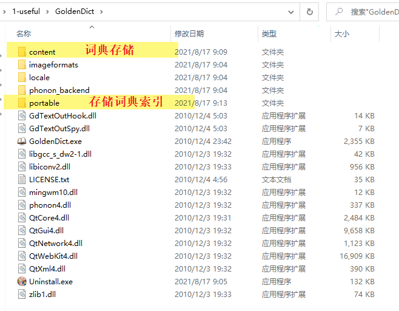
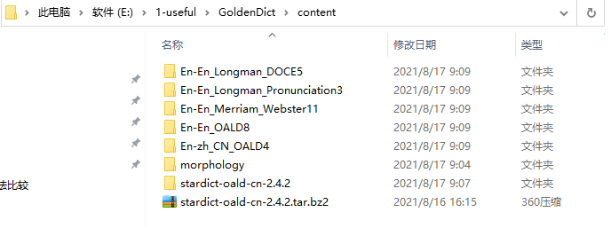
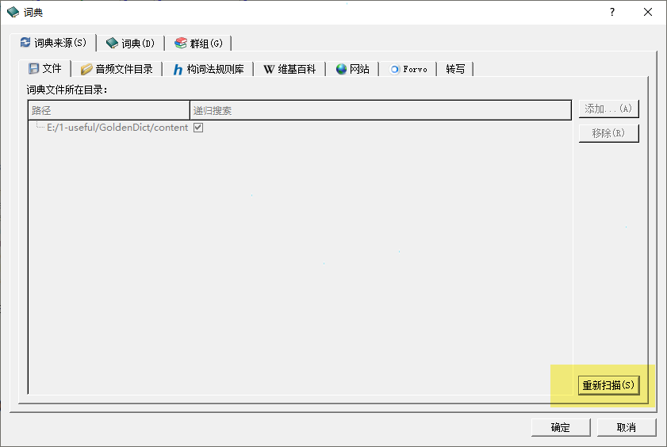

### 词典

> 好用词典，是成功学习语言的一半

在线词典

https://zhuanlan.zhihu.com/p/151810213

用户下载的离线词典存储于content，即可被软件识别

   

离线词典下载参考

http://download.huzheng.org/zh_CN/

https://www.zhihu.com/question/21133533

https://freemdict.com/tag/%e8%8b%b1%e8%af%ad/

**牛津高阶英汉双解词典(简体)第8版**

 **Longman**  **朗文当代高级英语辞典第六版**

**麦克米伦高阶英语词典第2版**  短语搭配

**柯林斯同义词词典 ** **Collins Thesaurus**

**USE THE RIGHT WORD**