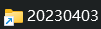
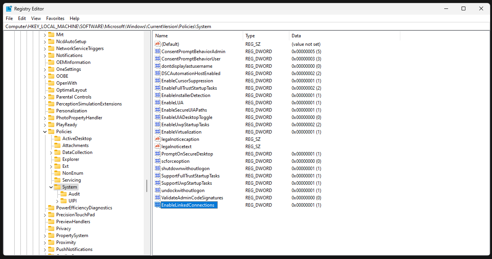
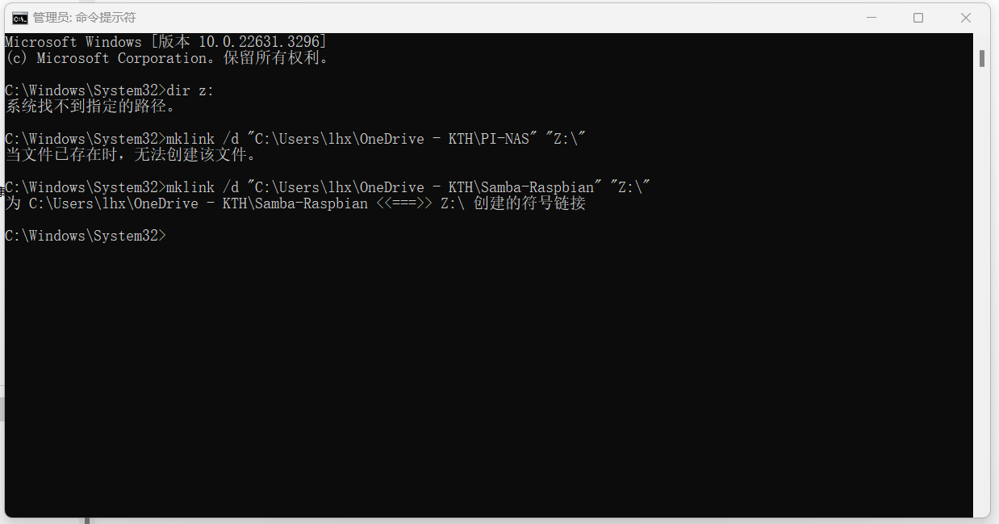

## OneDrive是否可以同步其他文件夹（除桌面，图片，文档，onedrive文件夹之外） 

> 无需拷贝文件到onedrive文件夹


将需要同步的文件所在文件夹生成对应的符号链接，符号链接中的文件的删改增，都会对应到源文件夹中，把符号链接拷贝到 onedrive 同步文件夹中就能实现文件夹内的文件的远端同步。 符号链接名和真实文件夹名可以不同。

注意： 删除虚拟的链接目录，并不会删除对应的真实文件夹和真实文件.


**操作方法：**

* 使用管理员权限打开cmd

* 输入命令，生成符号链接到onedrive同步文件夹中

	`mklink /d "C:\Users\[Username]\OneDrive\文档\Scholar" "F:\Documents\Scholar"`

	第一个路径为符号链接目标路径，第二个路径为需要同步的文件夹。

	其中，第一个路径需要注意两点：

	1."\文档\Scholar"之前的路径为OneDrive的路径。

	2."Onedrive\"之后的路径之所以建议为“文档\Scholar”，是因为大部分的用户都是将“文档文件夹”命名为“文档”。
	


​	生成的符号链接示意图：



**其他参考**

```
语法 mklink [[/d] |[/h] |[/j]]<Link>  <Target>

/d       创建目录的符号链接。 默认情况下mklink中创建文件的符号链接。
/h       创建硬链接，而不是符号链接。
/j       创建目录软链接。
<Link>   指定正在创建的符号链接的名称。
<Target> 指定新的符号链接指向的路径 （相对或绝对）。
/?       在命令提示符下显示帮助。
```

mklink 和 Linux 的 ln 的功能几乎一样。mklink / ln 便是用来创建符号链接的


https://blackboardtech.wordpress.com/2014/12/09/mapped-drive-system-cannot-find-the-path-specified/




虽然找不到驱动网络硬盘，但是可以建立软连接



```
mklink /d "C:\Users\lingh\OneDrive - KTH\PI-N" "Z:\"

mklink /d "C:\Users\lhx\OneDrive - KTH\Samba-Raspbian\movie" "Z:\电影"

mklink /d "C:\Users\lhx\OneDrive - KTH\Samba-Raspbian\小说" "Z:\FIle\2-小说文学"


mklink /d "C:\Users\lhx\OneDrive - KTH\MyFile" "D:\MyFile"

mklink /d "C:\Users\lhx\OneDrive - KTH\mail\home" "C:\Users\lhx\AppData\Roaming\Thunderbird\Profiles\7hw9mpmg.default-release\ImapMail" 

mklink /d "C:\Users\lingh\OneDrive - KTH\mail\office" "C:\Users\lingh\AppData\Roaming\Thunderbird\Profiles\i5d7kced.default-release\ImapMail"
```


