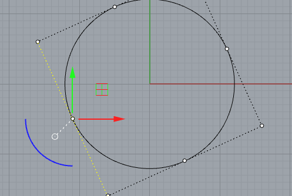
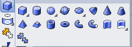

 

**工作平面设置**

犀牛每个视图的工作平面都是单独设置的，但是可以选择其他视图去辅助你定位工作面。可选择 `工作平面` 选项卡去设置

 

**捕获点**

锁定格点： 设置后，可以捕获`工作平面`的网格点

 

**物体位置移动** 

TIPS： 使用移动工具才能捕获中点，顶点，原点等标记点。

直接拖动没有标记点

 

### 曲线

**生成曲线**

* 实体->轮廓投影/获取轮廓  
* 曲面->轮廓投影/获取轮廓
* 直接绘制预定义形状曲线（圆等）
* 复制现有曲线

**曲线精确尺寸修改**

* 曲线改动：控制点可以拖动修改 （必须开启`操作轴`功能）

曲线控制点可以控制曲线的形状，通过 `操作轴` 可以随意拖拽控制点，工具可以帮助增加删除曲线上的控制点

 

图 控制点和操作轴；输入的数字代左右拖动的相对位移，也可以是相对的旋转(单位度)

* 曲线改动：三轴/二轴/单轴缩放功能，直接输入数字就可精确实现对应尺寸 

* 曲线新建：绘制预定义形状的曲线（圆/长方形）时可以直接输入尺寸数字

   

**特殊线** 

螺旋线/弹簧线  在曲线菜单里面找到弹簧线

### 曲面

**显示**

      

图 曲面的正反面设置； 碗形状的曲面显示效果

**生成曲面**

* 曲线挤出，封闭曲线生成  
* 实体炸开
* 直接绘制曲面
* 复制现有的曲面

**曲面精确尺寸修改**

* 控制点拖动修改，点击控制点在控制轴上输入数字可在原先位置实现相对的位移和偏移

* 曲面改动：三轴/二轴/单轴缩放功能，直接输入数字就可精确实现对应尺寸
* 曲面新建：绘制预定义形状的曲面（圆/长方形）时可以直接输入尺寸数字

### 实体（封闭曲面）

**显示**

 

**生成实体**

* 曲面挤出  或者，也只可直接使用`操作轴`进行挤出 
* 封闭曲面组合 
* 直接绘制实体 
* 复制现有的实体 

**实体精确尺寸修改**

* 控制点拖动修改，点击控制点在控制轴上输入数字可在原先位置实现相对的位移和偏移

* 曲面改动：三轴/二轴/单轴缩放功能，直接输入数字就可精确实现对应尺寸
* 曲面新建：绘制预定义形状的曲面（圆/长方形）时可以直接输入尺寸数字

显示控制点 - F10