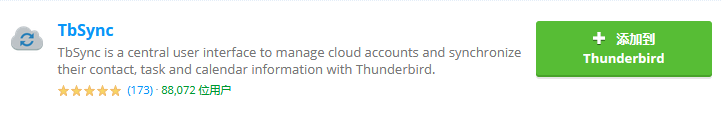
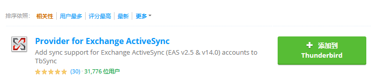
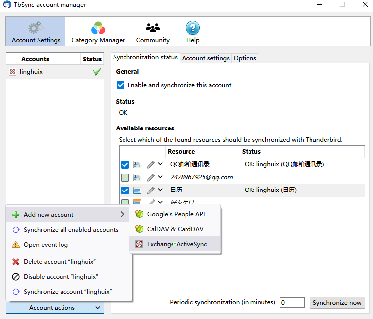
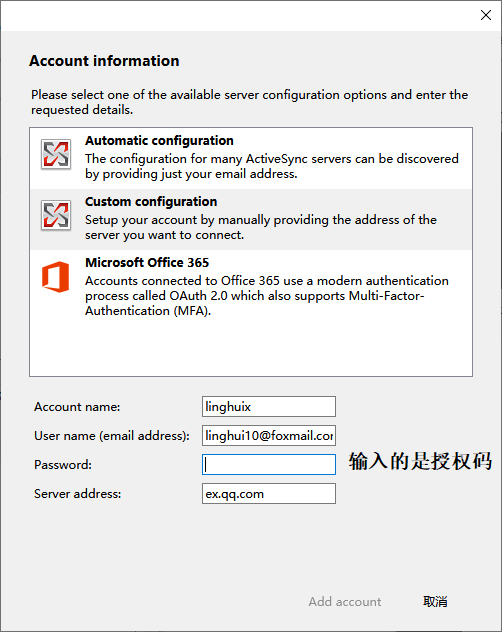
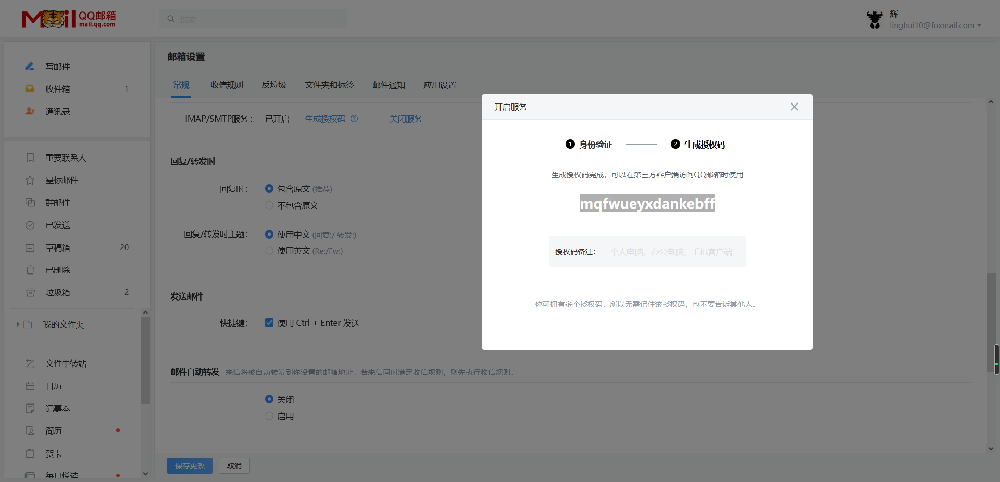

thunderbird 邮件客户端

https://blog.csdn.net/icurious/article/details/103901473

## Thunderbird

> ubuntu 默认邮件客户端；Windows，Mac 都有客户端

### 邮件登录

 

**QQ 邮件登录** 

账号为QQ邮件地址

密码为 STMP/ POP3 功能的授权码

[常用邮件客户端软件设置_QQ邮箱帮助中心](https://service.mail.qq.com/cgi-bin/help?subtype=1&&id=28&&no=371) 

**接收邮件服务器** POP3: pop.qq.com,使用SSL,端口号995 

**交互式邮件存取协议** IMAP: imap.qq.com, 使用SSL，端口号993

**发送邮件服务器** SMTP: smtp.qq.com, 使用SSL，端口号465或587

   

**浙江大学邮件登录**

账号为 ZJU 邮件地址

密码为 ZJU 邮件密码

zju  IMAP协议的 接收邮箱服务器为：`imap.zju.edu.cn`  ; 发送邮箱服务器为：`smtp.zju.edu.cn` 

zju  POP3协议的 接收邮箱服务器为：`pop3.zju.edu.cn` ; 发送邮箱服务器为：`smtp.zju.edu.cn` 

  

**新浪邮件** 

账号为 sina 邮件地址   linghuix100@sina.com

密码为 STMP/ POP3 功能的授权码   0a870b334e00d423

  

### 邮件日历同步和事件提醒

1. 选择下载 **Provider for Exchange** / **ActiveSync和TbSync** 插件 ，用于同步邮件的日历基于Exchange

 

2. 点击右下角可以设置同步账户

    

    

3. 输入账户信息，例子是qq邮箱的日历同步设置

   参考 https://service.mail.qq.com/cgi-bin/help?subtype=1&&id=20019&&no=1000913

   注意：password 输入的是开通 STMP/ POP3 功能的授权码

        

   图 日历同步配置； 授权码的获取

4. 同步日历选择和周期设置

     

5. 日历事件设置

    

## 网易邮箱客户端

登录QQ邮箱即可同步日历。但是要注意，有时候同步不完全，需要在QQ上修改对应的事件，才能同步到网易客户端上

 

 

## Outlook 

同步 https://www.zhihu.com/question/271291022

 