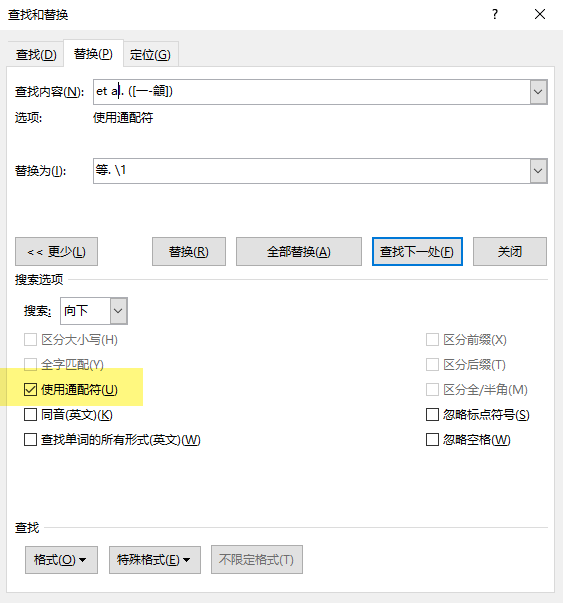

Ctrl+H 唤出界面



勾选住“使用通配符”
Word中通配符的规则和java大差不差：

```
？：匹配单个字符；

*：匹配多个字符；

-：范围匹配，例如[A-Z]会匹配“abc…”所有26个英文字母。中文匹配符[一-]，匹配一个中文字符

[]：选择匹配，例如：[白哈]度，会匹配"白度"和"哈度"。 

(): 匹配的组。例如([白哈])度, \1表示 匹配对象"白度"中的"白"

@：匹配一个以上的组， (123)@ 匹配多个"123"
```


通配符


注：此时 `\1` 只代表 `1`


http://blog.sina.com.cn/s/blog_3f3d80b50100r0r6.html

