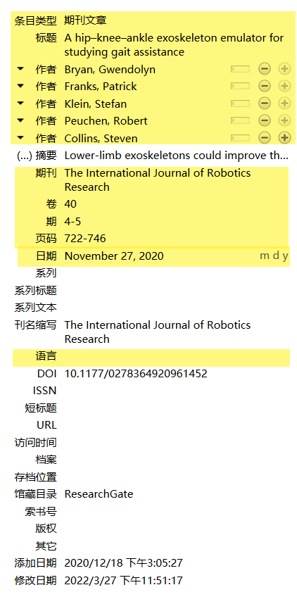

**页面和笔记中的字体大小修改**

  

1. 左上角-编辑-首选项

2. 高级-常规-设置编辑器

3. 输入“fontSize”，出现两个选项（上面那个是页面字体大小，下面那个是笔记字体大小），双击即可进行更改

**毕业论文文献格式** 

格式： [china-national-standard-gb-t-7714-2015-numeric 包含OL.csl](zotero.assets\参考格式\包含URL的文献引用会有OL\china-national-standard-gb-t-7714-2015-numeric 包含OL.csl)  

  

图 导入格式方式

毕业论文文献格式可参考 [知网]( https://zhuanlan.zhihu.com/p/355312827)， 下图为常用的文献 类型的格式

  

图 毕业论文文献格式 （专利，会议，英文期刊，网页，学位论文）

           

图 为实现完整的引用格式，必须正确填写的内容：1.专利，2.会议，3.英文期刊，4.网页，5.学位论文

论文的详细信息可以参考 —— 中文参考知网，英文参考 web of science

