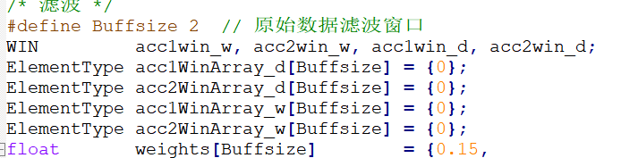
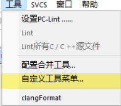
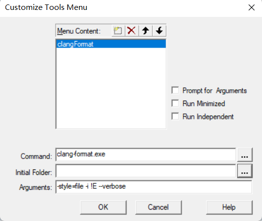

### CoolFormat


使用方法和集成到Keil上的方法 https://zhuanlan.zhihu.com/p/140500377


### AStyle

https://mp.weixin.qq.com/s/OcNxwFFNicNI0HP3oFpS5A


### Clang-Format

**安装** 

Windows下clang-format的安装 https://blog.csdn.net/wanlong1215/article/details/109509053

LLVM Snapshot Builds https://llvm.org/builds/


**命令行操作** 

使用默认的格式文件去格式化代码

`clang-format.exe -style=google -i .\main.c --verbose  //自动使用google标准格式化main.c文件`  


使用自定义的`.clang-format`文件去格式化代码，verbose表示显示操作的详细信息 

`clang-format.exe -style=file -i .\main.c --verbose   //自动使用所在文件夹或者父文件夹的.clang-format文件去格式化main.c文件`  


**`.clang-format` 文件的配置**

配置项含义参考：

* Clang-Format格式化选项介绍 https://blog.csdn.net/softimite_zifeng/article/details/78357898

* [对.clang-format的部分注释](https://bbs.huaweicloud.com/blogs/detail/308371) 
* https://www.cnblogs.com/__tudou__/p/13322854.html#%E5%91%BD%E4%BB%A4%E6%A0%BC%E5%BC%8F
* https://blog.csdn.net/sam2009944096/article/details/100589454
* https://www.jianshu.com/p/346f439d230c
* https://blog.csdn.net/softimite_zifeng/article/details/78357898


An easy way to create a `.clang-format` file is:

```shell
clang-format -style=llvm -dump-config > .clang-format
```


clang format 文件： [.clang-format](readme.assets\.clang-format) 


```javascript
# 连续声明时，对齐所有声明的变量名
AlignConsecutiveDeclarations: false
```

  


**keil上的集成** 

   

图 其中 `!E` 为keil中当前显示的文件。需要格式化当前文件时，点击 `工具-clangFormat` 即可 